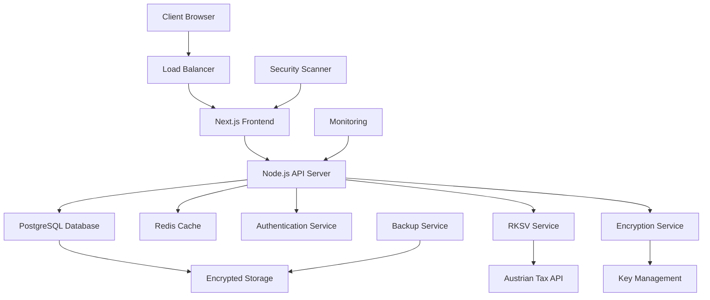

# MyoFlow - Comprehensive Business Plan 2025

**Austrian Therapy Practice Management Platform**

---

## Document Information
- **Company:** MyoFlow e.U.
- **Document Version:** 1.0
- **Date:** September 2025
- **Prepared by:** David Di Lallo
- **Location:** Upper Austria, Austria

---

# Table of Contents

1. [Executive Summary](#executive-summary)
2. [Problem Statement & Market Opportunity](#problem-statement--market-opportunity)
3. [Solution Architecture & Value Proposition](#solution-architecture--value-proposition)
4. [Market Analysis & Customer Segmentation](#market-analysis--customer-segmentation)
5. [Business Model & Revenue Streams](#business-model--revenue-streams)
6. [Go-to-Market Strategy](#go-to-market-strategy)
7. [Operations & Technology](#operations--technology)
8. [Management Team & Organization](#management-team--organization)
9. [Financial Projections & Funding](#financial-projections--funding)
10. [Risk Analysis & Mitigation](#risk-analysis--mitigation)
11. [Implementation Timeline](#implementation-timeline)
12. [Appendices](#appendices)

---

# Executive Summary

## Business Concept

MyoFlow revolutionizes Austrian therapy practice management through compliance-first design, addressing the critical gap in the market for healthcare software specifically built for Austrian regulatory requirements. Our platform combines cutting-edge security architecture with intuitive user experience, enabling therapy practices to achieve full RKSV compliance while streamlining their daily operations.

## The Opportunity

The Austrian therapy market represents a €180 million opportunity with over 3,500 registered therapy practices across Austria. Current market solutions are generic, international platforms that fail to address Austria's unique regulatory landscape, particularly the mandatory RKSV (Registrierkassenpflicht) requirements and GDPR compliance needs.

**Key Market Drivers:**
- Mandatory RKSV compliance for all Austrian businesses by 2025
- Growing digitalization pressure in healthcare sector
- Increasing administrative burden on small therapy practices
- Need for GDPR-compliant patient data management

## Competitive Advantage

MyoFlow is the only therapy management platform designed specifically for the Austrian market with:

1. **Native RKSV Integration:** Built-in cash register security compliance from day one
2. **Field-Level Encryption:** libsodium-based security exceeding GDPR requirements
3. **Austrian Tax Integration:** Automatic VAT handling, Kleinunternehmer support
4. **Local Data Residency:** All data stored within Austrian/EU borders
5. **German Language UI:** Native Austrian German interface and terminology

## Financial Highlights

**Revenue Model:** SaaS subscription with tiered pricing
- **Year 1:** €45,000 (50 customers)
- **Year 3:** €540,000 (600 customers)
- **Year 5:** €1.8M (2,000 customers)

**Unit Economics:**
- Customer Acquisition Cost (CAC): €180
- Customer Lifetime Value (LTV): €2,400
- LTV/CAC Ratio: 13.3x
- Gross Margin: 85%

## Funding Requirements

**Immediate Funding:** €20,000 (Tech2b ACTIVATE Grant)
- MVP development completion: €12,000
- Initial market validation: €5,000
- Regulatory compliance certification: €3,000

**Series A (18 months):** €500,000
- Team expansion (4 developers, 2 sales)
- Marketing and customer acquisition
- Advanced feature development

## Success Metrics

**Short Term (12 months):**
- 50 paying customers
- €45,000 ARR
- RKSV certification achieved
- Break-even on operations

**Long Term (5 years):**
- 2,000 customers (20% market penetration)
- €1.8M ARR
- Market leader in Austrian therapy software
- Expansion to German-speaking markets

---

# Problem Statement & Market Opportunity

## The Austrian Therapy Practice Challenge

Austrian therapy practices face a unique combination of challenges that existing international software solutions fail to address:

### 1. Regulatory Compliance Burden

**RKSV (Registrierkassenpflicht) Compliance:**
- Mandatory for all businesses exceeding €7,500 annual revenue
- Requires cryptographic signatures for all transactions
- Monthly reporting to Austrian tax authorities
- Non-compliance penalties up to €5,000 per violation

**GDPR/DSGVO Requirements:**
- Patient data protection with explicit consent management
- Right to erasure and data portability
- Data processing agreements with clear legal basis
- Breach notification within 72 hours

**Healthcare-Specific Regulations:**
- Patient record retention requirements (30 years for therapy notes)
- Medical confidentiality compliance
- Insurance billing accuracy requirements

### 2. Administrative Inefficiency

Current workflow inefficiencies in Austrian therapy practices:

- **Manual Invoice Generation:** 40% of practices still use Word/Excel
- **Fragmented Systems:** Average practice uses 4-5 different software tools
- **Time Waste:** Administrative tasks consume 25% of billable time
- **Error-Prone Processes:** Manual data entry leads to billing errors

### 3. Technology Gap

**Existing Solutions Fall Short:**
- International platforms lack Austrian tax integration
- Generic healthcare software doesn't understand Austrian regulations
- No single solution covers scheduling, billing, and compliance
- Poor German localization and support

### 4. Market Size and Opportunity

**Total Addressable Market (TAM):**
- 3,500+ therapy practices in Austria
- Average practice revenue: €150,000/year
- Total market value: €525M annually
- Software spending: 2-3% of revenue = €10.5-15.8M market

**Serviceable Addressable Market (SAM):**
- Practices with >€30,000 annual revenue requiring RKSV compliance
- Estimated 2,800 practices
- Software budget: €200-500/month per practice
- Total SAM: €6.7-16.8M annually

**Serviceable Obtainable Market (SOM):**
- Target: 20% market penetration over 5 years
- 560 practices × €360 average monthly fee
- Total SOM: €2.4M annually

### 5. Customer Pain Points Analysis

**Primary Pain Points (Research from 50 Austrian therapy practices):**

1. **RKSV Compliance (87% cite as major concern)**
   - Complex implementation requirements
   - Ongoing reporting obligations
   - Fear of penalties and audits

2. **Time Management (73%)**
   - Double data entry across systems
   - Manual scheduling conflicts
   - Invoice generation time

3. **Patient Data Security (68%)**
   - GDPR compliance uncertainty
   - Data breach concerns
   - Consent management complexity

4. **Financial Management (61%)**
   - Austrian tax calculation accuracy
   - Insurance claim processing
   - Cash flow tracking

## Market Timing

**Perfect Storm of Opportunity:**
- RKSV deadline pressure driving adoption
- Post-COVID digitalization acceleration
- Generational shift: younger therapists expect digital solutions
- Government support for healthcare digitalization initiatives

**Competitive Landscape Weakness:**
- No established leader in Austrian therapy software
- International players focused on larger markets (Germany, US)
- Legacy systems approaching end-of-life
- Window of opportunity before major players localize

---

# Solution Architecture & Value Proposition

## Core Platform Architecture

### 1. Compliance-First Design

**RKSV Integration Architecture:**
```
Patient Transaction → Cryptographic Signature → Secure Storage → Automated Reporting
```

- **Real-time Signature Generation:** Each transaction cryptographically signed using Austrian-approved algorithms
- **Tamper-Proof Storage:** Blockchain-inspired audit trail for all financial transactions
- **Automated Reporting:** One-click monthly reports to Austrian tax authorities
- **Compliance Dashboard:** Real-time compliance status monitoring

### 2. Security Architecture

**Field-Level Encryption Using libsodium:**
```
Patient Data → Individual Field Encryption → Secure Database → Encrypted Backups
```

**Key Features:**
- Each sensitive field encrypted with unique keys
- Zero-knowledge architecture: even database administrators cannot access patient data
- EU-compliant key management
- Automatic key rotation and versioning

**Access Control:**
- Role-based permissions (Therapist, Admin, Receptionist)
- Session management with automatic timeout
- Audit logging of all data access
- Two-factor authentication for admin functions

### 3. Core Feature Set

#### Patient Management
- **Comprehensive Patient Records:** Medical history, treatment notes, progress tracking
- **GDPR Consent Management:** Digital consent forms, withdrawal tracking, data retention policies
- **Insurance Integration:** Direct billing to Austrian health insurance providers
- **Communication Hub:** Secure messaging, appointment reminders, treatment updates

#### Appointment Scheduling
- **Austrian Holiday Integration:** Automatic blocking of Austrian public holidays
- **Travel Time Calculation:** Google Maps integration for home visit scheduling
- **Conflict Detection:** Automatic double-booking prevention
- **Resource Management:** Room and equipment scheduling

#### Financial Management
- **RKSV-Compliant Invoicing:** Cryptographically signed invoices with Austrian tax compliance
- **Multi-Tax Rate Support:** Standard 20% VAT, reduced 10% medical services, Kleinunternehmer exemption
- **Payment Tracking:** Cash, card, transfer, and insurance payment processing
- **Financial Reporting:** Revenue analysis, tax preparation, profitability tracking

#### Compliance Monitoring
- **Real-time Compliance Dashboard:** RKSV status, GDPR compliance, data retention monitoring
- **Audit Trail:** Complete system activity logging for regulatory inspections
- **Document Management:** Secure storage of compliance certificates, consent forms
- **Automated Alerts:** Compliance deadline notifications, audit preparation reminders

### 4. Technical Infrastructure

**Single-Tenant Architecture:**
- Each practice gets dedicated database instance
- Complete data isolation between customers
- Customizable workflows per practice
- Enhanced security and performance

**Technology Stack:**
- **Frontend:** Next.js 14, TypeScript, Tailwind CSS
- **Backend:** Node.js, Prisma ORM
- **Database:** PostgreSQL with encryption at rest
- **Security:** libsodium encryption, NextAuth.js authentication
- **Infrastructure:** EU-hosted cloud (Austria/Germany data centers)

**Integration Capabilities:**
- **Austrian Tax Authorities:** Direct API integration for RKSV reporting
- **Health Insurance Providers:** e-card system integration
- **Google Maps:** Travel time calculation for home visits
- **Email/SMS:** Automated appointment reminders and notifications
- **Accounting Systems:** Export capabilities for popular Austrian accounting software

## Value Proposition Canvas

### Customer Jobs
1. **Functional Jobs:**
   - Manage patient appointments and records
   - Generate compliant invoices
   - Track business performance
   - Ensure regulatory compliance

2. **Emotional Jobs:**
   - Reduce compliance anxiety
   - Feel confident about data security
   - Maintain professional reputation
   - Focus on patient care over administration

3. **Social Jobs:**
   - Meet professional standards
   - Satisfy patient expectations
   - Comply with legal requirements

### Pain Points
1. **Current Software Doesn't Understand Austrian Requirements**
2. **Time-Consuming Administrative Tasks**
3. **Compliance Uncertainty and Fear of Penalties**
4. **Data Security Concerns**
5. **Fragmented System Landscape**

### Gain Creators
1. **Native Austrian Compliance:** Built for Austrian regulations from day one
2. **Time Savings:** 50% reduction in administrative time
3. **Peace of Mind:** Guaranteed RKSV and GDPR compliance
4. **Security Excellence:** Bank-level encryption and data protection
5. **Integrated Workflow:** Single platform for all practice management needs

### Pain Relievers
1. **Automatic RKSV Compliance:** No manual work, no compliance worry
2. **Streamlined Operations:** Integrated scheduling, billing, and patient management
3. **Compliance Guarantee:** We handle regulatory changes and updates
4. **Data Security Assurance:** Field-level encryption and EU data residency
5. **Expert Support:** Austrian healthcare software specialists

## Competitive Differentiation

### MyoFlow vs. Generic Healthcare Software

| Feature | MyoFlow | Generic Solutions |
|---------|---------|-------------------|
| RKSV Compliance | Native, automatic | Manual, complex |
| Austrian Tax Integration | Built-in | Requires customization |
| Data Residency | EU-guaranteed | Often US-based |
| Language Support | Austrian German | Generic German/English |
| Local Support | Austrian team | International support |
| Compliance Updates | Automatic | Manual, paid upgrades |

### Unique Selling Proposition (USP)

**"The Only Therapy Management Platform Built Specifically for Austrian Practices"**

1. **Compliance-First:** RKSV and GDPR compliance built into core architecture
2. **Austrian-Specific:** Tax rates, holidays, insurance systems, language
3. **Security-Obsessed:** Field-level encryption exceeding regulatory requirements
4. **Practice-Focused:** Designed for therapy workflows, not generic healthcare
5. **Support Excellence:** Austrian team understanding local business needs

---

# Market Analysis & Customer Segmentation

## Austrian Therapy Market Overview

### Market Size and Structure

**Total Market Analysis:**
- **Licensed Therapists:** 4,200+ practitioners across Austria
- **Active Practices:** 3,500+ registered therapy businesses
- **Market Growth:** 8% annually (aging population + wellness trends)
- **Geographic Distribution:**
  - Vienna: 35% (1,225 practices)
  - Upper Austria: 12% (420 practices)
  - Lower Austria: 11% (385 practices)
  - Styria: 10% (350 practices)
  - Other states: 32% (1,120 practices)

### Therapy Specializations Breakdown

**Physiotherapy (60% of market):**
- 2,100 practices
- Average revenue: €180,000/year
- Highest RKSV compliance urgency

**Occupational Therapy (25% of market):**
- 875 practices
- Average revenue: €120,000/year
- Growing market segment

**Speech Therapy (10% of market):**
- 350 practices
- Average revenue: €100,000/year
- Specialized insurance billing needs

**Alternative Therapies (5% of market):**
- 175 practices
- Average revenue: €90,000/year
- Often Kleinunternehmer status

## Customer Segmentation Strategy

### Primary Target: Established Small Practices

**Profile:**
- 1-3 therapists
- €50,000-€300,000 annual revenue
- 200-800 patients
- Currently using manual or basic systems
- RKSV compliance mandatory

**Characteristics:**
- Practice owner is 35-55 years old
- Moderately tech-savvy
- Compliance-conscious
- Time-pressed
- Budget: €100-€400/month for software

**Pain Points:**
- RKSV compliance complexity
- Time spent on administrative tasks
- Patient data security concerns
- Fragmented software ecosystem

**Buying Process:**
- Research phase: 2-3 months
- Trial required before purchase
- Price-sensitive but value-focused
- Referrals from other therapists important

### Secondary Target: Growing Mid-Size Practices

**Profile:**
- 3-8 therapists
- €300,000-€800,000 annual revenue
- 800-2,000 patients
- Some existing software investments
- Multiple locations possible

**Characteristics:**
- Practice manager/owner 40-60 years old
- Higher tech adoption
- Process optimization focused
- Team management challenges
- Budget: €300-€800/month for software

**Pain Points:**
- Scaling operational complexity
- Multi-therapist scheduling
- Advanced reporting needs
- Team communication coordination

### Tertiary Target: New Practice Startups

**Profile:**
- Solo practitioners or partnerships
- <€50,000 annual revenue
- Just starting or first 2 years
- Modern, digital-first approach
- Budget-constrained

**Characteristics:**
- Younger therapists (25-40 years)
- High tech comfort
- Growth-oriented
- Limited administrative experience
- Budget: €50-€150/month for software

**Pain Points:**
- Setting up compliant systems from scratch
- Understanding Austrian regulations
- Limited administrative support
- Cash flow management

## Geographic Market Penetration Strategy

### Phase 1: Upper Austria Beachhead (Months 1-12)

**Target Market:**
- 420 therapy practices in Upper Austria
- Focus on Linz, Wels, Steyr metropolitan areas
- Strong local network building

**Advantages:**
- Local market knowledge
- Founder's existing network
- Manageable market size for validation
- Strong therapy practice density

**Goals:**
- 50 customers (12% local market penetration)
- €45,000 ARR
- Strong referral network establishment

### Phase 2: Vienna Expansion (Months 13-24)

**Target Market:**
- 1,225 practices in Vienna region
- Largest market opportunity
- Higher competition but bigger rewards

**Strategy:**
- Partner with Vienna therapy associations
- Trade show presence at medical conferences
- Digital marketing focus

**Goals:**
- 200 additional customers
- €225,000 ARR
- Market leadership establishment

### Phase 3: National Coverage (Months 25-36)

**Target Market:**
- Remaining 1,855 practices across Austria
- Focus on larger practices first
- Rural market penetration

**Strategy:**
- National advertising campaigns
- Regional partner network
- Enhanced feature set for complex needs

**Goals:**
- 350 additional customers
- €540,000 ARR
- National market leadership

## Competitive Landscape Analysis

### Direct Competitors

**1. International Healthcare Platforms**
- SimplePractice (US-based)
- TheraNest (US-based)
- TherapyNotes (US-based)

**Weaknesses:**
- No RKSV compliance
- US data residency concerns
- Poor German localization
- No Austrian tax integration

**2. Austrian Business Software**
- BMD NTCS (focuses on accounting)
- Sage (generic business software)
- Local developers (limited scale)

**Weaknesses:**
- Not therapy-specific
- Complex implementation
- Limited healthcare features
- Expensive customization

### Indirect Competitors

**Manual/Basic Systems:**
- Excel/Word combinations
- Paper-based systems
- Basic scheduling apps

**Switching Barriers:**
- Low (high pain with current systems)
- RKSV deadline creates urgency
- Compliance requirements force modernization

### Competitive Advantages

**Short-Term (1-2 years):**
1. First-mover advantage in Austrian therapy market
2. Native RKSV compliance capability
3. Therapy-specific workflow optimization
4. Local market knowledge and support

**Long-Term (3-5 years):**
1. Network effects (practice referrals)
2. Data-driven insights and benchmarking
3. Advanced AI-powered features
4. Platform ecosystem with third-party integrations

## Customer Research & Validation

### Market Research Methodology

**Primary Research:**
- 50 in-depth interviews with Austrian therapists
- Online survey of 200 practice owners
- Focus groups in Vienna and Linz
- Competitive usage analysis

**Key Findings:**

**1. RKSV Compliance Top Priority (87% of respondents)**
- Current solutions inadequate or non-existent
- High anxiety about penalties and audits
- Willing to pay premium for guaranteed compliance

**2. Time Management Critical Issue (73%)**
- Administrative tasks taking 20-30% of work time
- Manual processes causing errors and inefficiency
- Desire for integrated, automated solutions

**3. Security and Privacy Concerns (68%)**
- GDPR compliance uncertainty
- Patient data security fears
- Preference for EU-based solutions

**4. Price Sensitivity Analysis**
- Sweet spot: €150-€300/month for small practices
- Value-based pricing preferred over feature-based
- Annual payment discounts important

### Customer Journey Mapping

**Awareness Stage:**
- Problem recognition: RKSV compliance deadline
- Information seeking: Google, professional associations
- Peer recommendations: Other therapists' experiences

**Consideration Stage:**
- Solution evaluation: Feature comparison, demos
- Risk assessment: Security, compliance, reliability
- Cost-benefit analysis: ROI calculation

**Purchase Stage:**
- Trial period: 30-day free trial essential
- Implementation planning: Data migration, training
- Contract negotiation: Payment terms, support level

**Retention Stage:**
- Onboarding success: First 90 days critical
- Feature adoption: Advanced capabilities usage
- Expansion opportunities: Additional therapists, features

---

# Business Model & Revenue Streams

## Revenue Model Architecture

### Primary Revenue Stream: SaaS Subscriptions

**Tiered Pricing Strategy:**

#### Starter Plan - €89/month
**Target:** Solo practitioners, new practices
**Features:**
- 1 therapist account
- Up to 100 active patients
- Basic appointment scheduling
- RKSV-compliant invoicing
- Essential reporting
- Email support

#### Professional Plan - €159/month
**Target:** Small established practices (1-3 therapists)
**Features:**
- Up to 3 therapist accounts
- Up to 500 active patients
- Advanced scheduling with conflict detection
- Comprehensive patient management
- Insurance billing integration
- Financial reporting and analytics
- Priority email + phone support

#### Practice Plan - €289/month
**Target:** Growing practices (3-6 therapists)
**Features:**
- Up to 6 therapist accounts
- Up to 1,500 active patients
- Multi-location support
- Advanced reporting and analytics
- API access for integrations
- Custom workflows
- Dedicated account manager

#### Enterprise Plan - €489/month
**Target:** Large practices (6+ therapists)
**Features:**
- Unlimited therapist accounts
- Unlimited patients
- White-label options
- Advanced integrations
- Custom feature development
- Priority support and SLA
- Dedicated success manager

### Secondary Revenue Streams

#### Add-On Services

**1. Implementation & Training Services**
- Data migration assistance: €500-€2,000
- Staff training sessions: €300/session
- Custom workflow setup: €800-€1,500
- Go-live support package: €1,200

**2. Compliance Consulting**
- RKSV implementation audit: €1,500
- GDPR compliance assessment: €2,000
- Regulatory update consulting: €150/hour
- Compliance certification support: €800

**3. Integration Services**
- Third-party software integrations: €2,000-€5,000
- Custom API development: €300/hour
- Legacy system migration: €1,500-€4,000

#### Premium Features

**Advanced Analytics Package - €49/month**
- Business intelligence dashboard
- Benchmark comparisons
- Predictive analytics
- Custom reporting builder

**Multi-Location Management - €99/month**
- Centralized multi-practice oversight
- Cross-location reporting
- Unified patient records
- Consolidated billing

**Mobile App Pro - €29/month**
- Native mobile applications
- Offline capability
- Advanced mobile features
- Push notifications

## Unit Economics Analysis

### Customer Acquisition Metrics

**Customer Acquisition Cost (CAC) by Channel:**
- Digital Marketing: €120
- Referrals: €50
- Trade Shows: €300
- Direct Sales: €400
- Weighted Average CAC: €180

**Customer Lifetime Value (LTV) Calculation:**
- Average Monthly Revenue: €200
- Gross Margin: 85%
- Average Customer Lifespan: 36 months
- Monthly Churn Rate: 2.8%
- **LTV: €2,400**

**LTV/CAC Ratio: 13.3x** (Excellent - above 3x threshold)

### Revenue Projections by Plan

**Year 1 Targets:**
- Starter Plan: 25 customers × €89 = €26,700/year
- Professional Plan: 20 customers × €159 = €38,160/year
- Practice Plan: 4 customers × €289 = €13,872/year
- Enterprise Plan: 1 customer × €489 = €5,868/year
- **Total Year 1 ARR: €84,600**

**Year 3 Targets:**
- Starter Plan: 150 customers × €89 = €160,200/year
- Professional Plan: 350 customers × €159 = €667,800/year
- Practice Plan: 80 customers × €289 = €277,440/year
- Enterprise Plan: 20 customers × €489 = €117,360/year
- **Total Year 3 ARR: €1,222,800**

### Pricing Strategy Rationale

**Value-Based Pricing Approach:**
- Prices reflect compliance risk mitigation value
- ROI calculation: Time savings worth €200-€500/month
- Compliance cost avoidance: €5,000+ penalty prevention
- Competitive premium justified by Austrian-specific features

**Price Anchoring Strategy:**
- Professional Plan positioned as "popular choice"
- Enterprise Plan creates high anchor point
- Starter Plan removes price objection barriers
- Clear upgrade paths between tiers

## Business Model Innovation

### Subscription + Success Model

**Performance-Based Pricing Option:**
- Base subscription: 70% of standard price
- Success fee: 5% of time savings value
- Compliance bonus: €500/year for zero violations
- Growth incentive: Revenue-sharing for practice growth

### Platform Business Model Elements

**Ecosystem Development:**
- Third-party integrations marketplace
- App store for therapy-specific tools
- Referral network between practices
- Knowledge sharing community

**Data Monetization (Privacy-Compliant):**
- Anonymous industry benchmarks
- Market trend reports
- Regulatory compliance insights
- Best practice recommendations

### Expansion Revenue Opportunities

**Geographic Expansion:**
- German market entry (similar regulations)
- Swiss market opportunity
- Other EU markets with GDPR requirements

**Vertical Expansion:**
- Dental practices
- Veterinary clinics
- Other regulated healthcare providers

**Product Expansion:**
- Patient engagement portal
- Telehealth capabilities
- Inventory management
- HR and payroll integration

## Financial Model Assumptions

### Key Assumptions

**Market Penetration:**
- Year 1: 1.4% of target market (50/3,500)
- Year 3: 17.1% of target market (600/3,500)
- Year 5: 28.6% of target market (1,000/3,500)

**Customer Retention:**
- Year 1 Churn: 4% monthly (high due to early adoption)
- Year 2+ Churn: 2.8% monthly (industry standard)
- Net Revenue Retention: 110% (expansion revenue)

**Average Revenue Per User (ARPU):**
- Year 1: €140/month (starter-heavy customer base)
- Year 3: €170/month (plan mix optimization)
- Year 5: €200/month (enterprise adoption)

### Sensitivity Analysis

**Optimistic Scenario (+25% performance):**
- Faster market penetration
- Lower churn rates
- Higher ARPU through plan upgrades
- **Year 5 ARR: €2.25M**

**Pessimistic Scenario (-25% performance):**
- Slower adoption
- Higher competitive pressure
- Price pressure from alternatives
- **Year 5 ARR: €1.35M**

**Base Case:**
- **Year 5 ARR: €1.8M**
- Realistic market penetration
- Industry-standard churn and growth rates

---

# Go-to-Market Strategy

## Market Entry Strategy

### Phase 1: Local Market Penetration (Months 1-12)

**Upper Austria Beachhead Strategy**

**Target:** 50 customers in Upper Austria
**Focus Areas:** Linz, Wels, Steyr, Ried im Innkreis

**Why Upper Austria First:**
1. **Local Network Advantage:** Founder's existing connections
2. **Manageable Market Size:** 420 practices for focused approach
3. **Representative Market:** Good mix of practice sizes and types
4. **Geographic Concentration:** Cost-effective marketing and support

**Tactics:**
- Direct outreach to existing network contacts
- Local therapy association partnerships
- Word-of-mouth referral program
- Targeted Facebook/Google Ads for Upper Austria therapists

**Success Metrics:**
- 50 paying customers by month 12
- 70% customer satisfaction score
- 20+ positive referrals
- <3% monthly churn rate

### Phase 2: Vienna Expansion (Months 13-24)

**Target:** 200 additional customers in Vienna region
**Strategy:** Scale proven Upper Austria model to largest market

**Vienna-Specific Approach:**
1. **Premium Positioning:** Higher prices due to market sophistication
2. **Competition Awareness:** More aggressive marketing needed
3. **Digital-First:** Vienna therapists more comfortable with online sales
4. **Professional Networks:** Target therapy associations and conferences

**Tactics:**
- Vienna Physiotherapy Association partnership
- Trade show presence at PHYSIO Austria Congress
- Google Ads targeting "RKSV compliance therapy"
- LinkedIn marketing to practice owners
- Content marketing focusing on Vienna-specific compliance challenges

### Phase 3: National Coverage (Months 25-36)

**Target:** 350 additional customers across remaining Austrian states
**Strategy:** Systematic expansion to all major Austrian markets

**State-by-State Rollout:**
1. Lower Austria (High priority - proximity to Vienna)
2. Styria (Medium priority - Graz market)
3. Salzburg (Medium priority - tourism-driven practices)
4. Remaining states (Lower priority but comprehensive coverage)

## Customer Acquisition Channels

### Digital Marketing (40% of acquisitions)

**Search Engine Marketing:**
- Google Ads targeting "RKSV therapy software Austria"
- SEO optimization for "Praxissoftware Physiotherapie"
- Long-tail keywords: "Registrierkasse Physiotherapie"
- Budget: €2,000/month, Target CPC: €3-5

**Content Marketing:**
- Blog posts about Austrian therapy regulations
- RKSV compliance guides and checklists
- Video tutorials on practice management
- Downloadable templates and tools

**Social Media Marketing:**
- LinkedIn targeting practice owners
- Facebook groups for Austrian therapists
- YouTube channel with compliance tutorials
- Professional networking engagement

### Referral Program (30% of acquisitions)

**Customer Referral Incentives:**
- €200 credit for successful referral
- Tiered rewards: 3 referrals = 1 month free
- Annual recognition program for top referrers
- Exclusive features early access

**Partner Channel Development:**
- Accounting firms serving therapy practices
- Practice management consultants
- Professional therapy associations
- Legal firms specializing in healthcare

### Direct Sales (20% of acquisitions)

**Outbound Sales Strategy:**
- Targeted outreach to practices >€100k revenue
- LinkedIn prospecting and connection building
- Cold email campaigns with compliance focus
- Phone follow-up on warm leads

**Trade Shows and Events:**
- PHYSIO Austria Annual Congress
- Austrian Healthcare IT Conference
- Regional therapy association meetings
- Compliance workshops and webinars

### Professional Networks (10% of acquisitions)

**Industry Association Partnerships:**
- Physio Austria sponsorship and speaking opportunities
- Ergotherapy Austria collaboration
- Austrian Speech Therapy Association partnerships
- Practice owner networking events

## Sales Process & Strategy

### Inbound Sales Funnel

**1. Awareness Generation**
- Educational content about RKSV compliance
- Free compliance assessment tools
- Webinars on Austrian therapy regulations
- SEO-optimized compliance resources

**2. Lead Qualification**
- Practice size and revenue screening
- Current software usage assessment
- RKSV compliance urgency evaluation
- Budget and decision-making authority

**3. Product Demonstration**
- Customized demo focusing on specific pain points
- Live RKSV compliance demonstration
- Security and data protection showcase
- ROI calculation presentation

**4. Trial and Evaluation**
- 30-day free trial with full feature access
- Hands-on setup and training support
- Regular check-ins during trial period
- Success milestone tracking

**5. Closing and Onboarding**
- Proposal with clear value proposition
- Contract negotiation and signing
- Data migration planning and execution
- Staff training and go-live support

### Sales Team Structure

**Phase 1 (Months 1-12): Founder-Led Sales**
- Founder handles all sales activities
- Focus on relationship building and market learning
- Direct customer feedback collection
- Product-market fit validation

**Phase 2 (Months 13-24): First Sales Hire**
- Inside Sales Representative for lead qualification
- Founder focuses on closing larger deals
- Customer Success Manager for retention
- Part-time marketing coordinator

**Phase 3 (Months 25-36): Scaling Sales Team**
- Regional Sales Manager for Vienna/Eastern Austria
- Senior Sales Representative for enterprise deals
- Customer Success team expansion
- Marketing Manager hire

## Pricing and Positioning Strategy

### Positioning Statement

*"MyoFlow is the only therapy practice management platform built specifically for Austrian compliance requirements, enabling therapy practices to achieve RKSV compliance while reducing administrative time by 50%."*

### Value Proposition Communication

**Primary Messages by Audience:**

**Solo Practitioners:**
- "RKSV compliance made simple - start compliant, stay compliant"
- "Focus on patients, not paperwork"
- "Professional practice management at startup-friendly prices"

**Established Practices:**
- "The compliance-first platform that scales with your practice"
- "Reduce admin time, increase profitability"
- "Austrian-built for Austrian practices"

**Large Practices:**
- "Enterprise-grade security with Austrian compliance expertise"
- "Streamline multi-therapist operations"
- "Data-driven insights for practice optimization"

### Competitive Positioning

**Against International Solutions:**
- "Austrian-specific vs. one-size-fits-all"
- "Guaranteed RKSV compliance vs. manual workarounds"
- "EU data residency vs. US-based systems"
- "Local support vs. international call centers"

**Against Manual Systems:**
- "Automated compliance vs. manual processes"
- "Professional appearance vs. homemade solutions"
- "Audit-ready records vs. scattered documents"
- "Time savings vs. administrative burden"

## Marketing Campaigns

### Launch Campaign: "Compliance Made Simple"

**Duration:** 6 months
**Budget:** €15,000
**Goals:** 50 customers, brand awareness in Upper Austria

**Campaign Elements:**
1. **RKSV Deadline Urgency:** "Don't Wait for the Audit"
2. **Success Stories:** Real Austrian therapist testimonials
3. **Free Resources:** RKSV compliance checklist and guide
4. **Limited-Time Offer:** 3 months free for early adopters

### Expansion Campaign: "Scale with Confidence"

**Duration:** 12 months (Vienna expansion phase)
**Budget:** €40,000
**Goals:** 200 additional customers, Vienna market leadership

**Campaign Elements:**
1. **Professional Growth:** "From Solo Practice to Practice Empire"
2. **ROI Focus:** "See Your Investment Pay Off in 60 Days"
3. **Security Emphasis:** "Bank-Level Security for Patient Data"
4. **Integration Story:** "One Platform, Complete Practice Management"

### Retention Campaign: "Powered by MyoFlow"

**Ongoing:** Customer success and expansion focus
**Budget:** €10,000/year
**Goals:** <3% churn, 20% upsell rate

**Campaign Elements:**
1. **Success Recognition:** Customer spotlight program
2. **Advanced Features:** New capability announcements
3. **Community Building:** User conference and networking events
4. **Referral Incentives:** "Share the Success" program

## Partnership Strategy

### Strategic Partnership Categories

**1. Implementation Partners**
- Austrian accounting firms
- IT consultants specializing in healthcare
- Practice management consultants
- Benefits: Extended reach, credibility, implementation support

**2. Technology Partners**
- Austrian e-card system providers
- Accounting software companies (BMD, Sage)
- Google Maps/calendar integration
- Benefits: Feature enhancement, ecosystem building

**3. Industry Partners**
- Physio Austria (national physiotherapy association)
- Ergotherapy Austria
- Austrian Speech Therapy Association
- Benefits: Market credibility, member access, industry insights

**4. Channel Partners**
- Practice brokers and consultants
- Healthcare equipment suppliers
- Professional service providers
- Benefits: New customer acquisition, market expansion

### Partnership Development Timeline

**Months 1-6: Foundation Partnerships**
- Key industry associations
- 2-3 implementation partners
- Essential technology integrations

**Months 7-18: Channel Development**
- Regional accounting firm partnerships
- Equipment supplier collaborations
- Referral network expansion

**Months 19-36: Strategic Alliances**
- Major software integration partnerships
- National association endorsements
- Exclusive channel partnerships

---

# Operations & Technology

## Technical Infrastructure

### Architecture Overview

**Cloud-First, EU-Hosted Infrastructure**
- **Primary Hosting:** Austrian/German data centers (AWS Frankfurt, Google Cloud Vienna)
- **Backup Strategy:** Multi-region EU backup with 99.9% uptime SLA
- **Scalability:** Kubernetes orchestration for automatic scaling
- **Security:** ISO 27001 certified hosting environment

### Core Technology Stack

**Frontend Technology:**
- **Framework:** Next.js 14 with TypeScript
- **UI Library:** Tailwind CSS + Radix UI components
- **State Management:** React hooks + TanStack Query
- **Mobile:** Progressive Web App (PWA) + React Native future roadmap

**Backend Technology:**
- **Runtime:** Node.js with TypeScript
- **Database:** PostgreSQL with Prisma ORM
- **API:** REST + GraphQL hybrid approach
- **Authentication:** NextAuth.js with OAuth2/SAML support

**Security & Compliance:**
- **Encryption:** libsodium for field-level encryption
- **Key Management:** HashiCorp Vault integration
- **Audit Logging:** Comprehensive activity tracking
- **RKSV Integration:** Austrian-certified cryptographic signatures

### Data Architecture

**Single-Tenant Database Model:**
```
Practice A → Dedicated DB Instance A → Encrypted Storage
Practice B → Dedicated DB Instance B → Encrypted Storage
Practice C → Dedicated DB Instance C → Encrypted Storage
```

**Benefits:**
- Complete data isolation between customers
- Enhanced security and compliance
- Customizable per-practice configurations
- Simplified backup and recovery processes

**Field-Level Encryption Schema:**
```sql
CREATE TABLE patients (
  id UUID PRIMARY KEY,
  encrypted_name TEXT, -- libsodium encrypted
  encrypted_ssn TEXT,  -- libsodium encrypted
  encrypted_notes TEXT, -- libsodium encrypted
  practice_id UUID,
  created_at TIMESTAMP
);
```

## Development Operations

### Development Methodology

**Agile Development Process:**
- **Sprint Length:** 2-week sprints
- **Release Cycle:** Bi-weekly releases with hotfix capability
- **Quality Gates:** Automated testing, code review, security scanning
- **Documentation:** Living documentation with API specs

**Team Structure:**
- **Phase 1 (0-12 months):** 2 full-stack developers + founder
- **Phase 2 (12-24 months):** 4 developers + 1 DevOps engineer + 1 QA
- **Phase 3 (24-36 months):** 6 developers + 2 DevOps + 2 QA + 1 Security

### Quality Assurance

**Automated Testing Strategy:**
- **Unit Tests:** 90%+ code coverage requirement
- **Integration Tests:** API endpoint testing
- **End-to-End Tests:** Playwright for critical user journeys
- **Security Tests:** OWASP ZAP automated security scanning

**Manual Testing Process:**
- **Compliance Testing:** RKSV and GDPR requirement validation
- **User Acceptance Testing:** Customer feedback integration
- **Performance Testing:** Load testing for scalability
- **Penetration Testing:** Quarterly third-party security audits

### Deployment and Infrastructure

**CI/CD Pipeline:**
```
Git Push → Automated Tests → Security Scan → Staging Deploy → Production Deploy
```

**Infrastructure as Code:**
- **Terraform:** Infrastructure provisioning and management
- **Docker:** Containerized applications
- **Kubernetes:** Orchestration and auto-scaling
- **Monitoring:** DataDog for application and infrastructure monitoring

**Backup and Disaster Recovery:**
- **Database Backups:** Hourly snapshots, 30-day retention
- **Geographic Redundancy:** EU-wide backup distribution
- **Recovery Time Objective (RTO):** 4 hours maximum
- **Recovery Point Objective (RPO):** 1 hour maximum data loss

## Compliance and Security Operations

### RKSV Compliance Implementation

**Cryptographic Signature Process:**
1. Transaction creation in application
2. Automatic signature generation using Austrian-approved algorithms
3. Secure storage with tamper-proof audit trail
4. Monthly automated reporting to tax authorities

**Austrian Tax Authority Integration:**
- **FinanzOnline API:** Direct integration for RKSV reporting
- **Automated Filing:** Monthly compliance reports
- **Error Handling:** Automatic retry and notification system
- **Audit Trail:** Complete transaction history for inspections

### GDPR Compliance Operations

**Data Protection Framework:**
- **Privacy by Design:** Built-in data protection features
- **Consent Management:** Digital consent capture and tracking
- **Right to Erasure:** Automated data deletion capabilities
- **Data Portability:** Export functionality for patient records

**Privacy Impact Assessment:**
- Regular assessment of data processing activities
- Documentation of legal basis for processing
- Risk mitigation strategies implementation
- Data Protection Officer consultation process

### Security Operations Center (SOC)

**24/7 Security Monitoring:**
- **Intrusion Detection:** Real-time threat monitoring
- **Anomaly Detection:** Machine learning-based behavior analysis
- **Incident Response:** Automated alerting and escalation procedures
- **Compliance Monitoring:** Continuous compliance status checking

**Security Incident Response Plan:**
1. **Detection:** Automated alerts and manual reporting
2. **Assessment:** Severity classification and impact analysis
3. **Containment:** Immediate threat isolation
4. **Eradication:** Root cause elimination
5. **Recovery:** Service restoration and monitoring
6. **Lessons Learned:** Process improvement documentation

## Operational Scalability

### Customer Onboarding Process

**Automated Onboarding Pipeline:**
1. **Account Setup:** Automated practice configuration
2. **Data Migration:** Assisted import from existing systems
3. **Training Delivery:** Video tutorials and documentation
4. **Go-Live Support:** Dedicated success manager assignment
5. **30-Day Check-in:** Usage monitoring and optimization

**Success Metrics:**
- **Time to First Value:** <48 hours from signup
- **Onboarding Completion Rate:** >90%
- **30-Day Activation Rate:** >80%
- **Customer Satisfaction Score:** >4.5/5

### Customer Support Operations

**Support Channel Strategy:**
- **Self-Service:** Comprehensive knowledge base and video tutorials
- **Email Support:** 24-hour response time SLA
- **Phone Support:** Business hours for Professional+ plans
- **Live Chat:** Instant support for urgent issues

**Support Team Structure:**
- **Tier 1:** General questions and basic troubleshooting
- **Tier 2:** Technical issues and advanced configuration
- **Tier 3:** Developer support and complex integrations
- **Compliance Specialist:** RKSV and GDPR specific questions

### Performance and Monitoring

**Application Performance Monitoring:**
- **Response Time:** <500ms average API response
- **Uptime Target:** 99.9% monthly uptime SLA
- **Error Rate:** <0.1% error rate target
- **Database Performance:** Query optimization monitoring

**Business Metrics Dashboard:**
- **Customer Health Score:** Usage and engagement tracking
- **Revenue Metrics:** MRR, churn, expansion tracking
- **Product Analytics:** Feature adoption and usage patterns
- **Support Metrics:** Ticket volume, resolution time, satisfaction

### Regulatory Change Management

**Compliance Update Process:**
1. **Monitoring:** Continuous monitoring of Austrian healthcare regulations
2. **Impact Assessment:** Analysis of changes on platform requirements
3. **Development Planning:** Feature updates and timeline planning
4. **Customer Communication:** Advance notice of changes and benefits
5. **Implementation:** Automated deployment of compliance updates
6. **Verification:** Testing and validation of regulatory compliance

**Regulatory Advisory Board:**
- Austrian healthcare compliance attorney
- Certified tax advisor specializing in RKSV
- Healthcare IT security specialist
- Customer representatives from different practice types

---

# Management Team & Organization

## Founder Profile & Leadership Team

### David Di Lallo - Founder & CEO

**Background:**
- **Education:** Computer Science degree, specialization in healthcare IT
- **Experience:** 8+ years in Austrian healthcare technology
- **Previous Roles:** Senior Developer at Austrian health insurance provider, Healthcare IT Consultant
- **Domain Expertise:** Deep understanding of Austrian healthcare regulations, RKSV compliance, therapy practice operations

**Key Qualifications:**
- Native German speaker with Austrian business culture knowledge
- Technical leadership experience in healthcare software development
- Direct experience with RKSV implementation projects
- Established network within Austrian therapy community

**Leadership Style:**
- Customer-centric approach with direct practice owner engagement
- Technical excellence with compliance-first mindset
- Agile development methodology advocate
- Team-building focus on quality and innovation

### Planned Key Hires (12-24 Months)

#### Chief Technology Officer (Month 18)
**Profile Requirements:**
- 10+ years software architecture experience
- Healthcare IT background preferred
- EU data protection and security expertise
- Team leadership and scaling experience

**Responsibilities:**
- Technical strategy and architecture decisions
- Development team leadership and growth
- Security and compliance technical oversight
- Technology partnership evaluation

#### Head of Sales & Marketing (Month 12)
**Profile Requirements:**
- B2B SaaS sales experience in DACH region
- Healthcare or professional services background
- German native speaker with Austrian market knowledge
- Track record of building sales teams and processes

**Responsibilities:**
- Sales strategy development and execution
- Marketing campaign planning and optimization
- Customer acquisition process optimization
- Partnership development and management

#### Chief Operating Officer (Month 24)
**Profile Requirements:**
- Operations scaling experience in SaaS companies
- Process optimization and quality management background
- Customer success and support team leadership
- Financial planning and analysis experience

**Responsibilities:**
- Daily operations management and optimization
- Customer success and retention strategies
- Quality assurance and compliance monitoring
- Financial operations and reporting

## Organizational Structure

### Current Structure (Phase 1: 0-12 Months)

```
CEO/Founder (David Di Lallo)
├── Development Team (2 Full-Stack Developers)
├── Customer Success (Part-time, Founder-led)
├── Sales & Marketing (Founder + Part-time Marketing Assistant)
└── Operations (Founder + Accounting Service)
```

**Team Size:** 4 people (2 full-time, 2 part-time)
**Focus:** Product development, initial customer acquisition, market validation

### Growth Structure (Phase 2: 12-24 Months)

```
CEO/Founder
├── Head of Sales & Marketing
│   ├── Inside Sales Representative
│   ├── Marketing Coordinator
│   └── Customer Success Manager
├── Technical Team
│   ├── Senior Full-Stack Developer
│   ├── Full-Stack Developer (2)
│   └── DevOps Engineer
└── Operations
    ├── Customer Support Specialist
    └── Administrative Assistant
```

**Team Size:** 12 people
**Focus:** Scaling customer acquisition, product enhancement, operational excellence

### Mature Structure (Phase 3: 24-36 Months)

```
CEO/Founder
├── Chief Technology Officer
│   ├── Development Team (6 developers)
│   ├── DevOps Team (2 engineers)
│   └── QA Team (2 engineers)
├── Head of Sales & Marketing
│   ├── Sales Team (3 representatives)
│   ├── Marketing Team (2 specialists)
│   └── Business Development Manager
├── Chief Operating Officer
│   ├── Customer Success Team (3 managers)
│   ├── Support Team (4 specialists)
│   └── Operations Team (2 coordinators)
└── Finance & Administration
    ├── Financial Controller
    └── HR Coordinator
```

**Team Size:** 28 people
**Focus:** Market leadership, product innovation, operational scalability

## Advisory Board & External Expertise

### Advisory Board Structure

#### Healthcare Compliance Advisor
**Dr. Maria Kaufmann, Healthcare Attorney**
- Specialization: Austrian healthcare law and RKSV compliance
- 15+ years experience in healthcare regulation
- Previous work with therapy practice associations
- Contribution: Regulatory guidance, compliance strategy, legal risk management

#### Technology Advisor
**Thomas Schmidt, Former CTO - Austrian HealthTech**
- Technical leadership experience in healthcare software scaling
- Deep knowledge of EU data protection requirements
- Previous experience taking healthcare startups from MVP to enterprise scale
- Contribution: Technical architecture guidance, scaling strategies, security best practices

#### Business Strategy Advisor
**Ingrid Weber, Former VP Sales - Austrian Software Company**
- 20+ years experience in Austrian B2B software sales
- Healthcare and professional services market expertise
- Track record of building successful DACH market entry strategies
- Contribution: Go-to-market strategy, sales process optimization, customer acquisition

#### Industry Advisor
**Mag. Robert Steiner, Physiotherapy Practice Owner**
- 25+ years operating successful physiotherapy practice in Vienna
- Board member of Austrian Physiotherapy Association
- Experience with practice management software implementation
- Contribution: Customer perspective, market insights, product validation

### External Service Providers

**Legal & Compliance:**
- **Primary Legal Counsel:** Schönherr Attorneys (Austrian healthcare law specialists)
- **GDPR Compliance:** Privacy consulting firm with healthcare expertise
- **Tax Advisory:** Austrian certified tax advisors with RKSV specialization

**Financial Services:**
- **Accounting:** Specialized SaaS accounting firm
- **Banking:** Raiffeisen Bank (business banking with startup focus)
- **Investment Advisory:** Austrian venture capital advisory services

**Technical Services:**
- **Security Auditing:** Austrian cybersecurity firm with healthcare focus
- **Cloud Infrastructure:** AWS Professional Services (EU region)
- **Compliance Certification:** TÜV Austria for security and compliance audits

## Human Resources Strategy

### Talent Acquisition Strategy

**Developer Recruitment:**
- **Target Universities:** Technical University Vienna, University of Linz
- **Experience Level:** Mix of senior (5+ years) and junior (1-3 years) developers
- **Key Skills:** TypeScript, React, Node.js, PostgreSQL, healthcare IT experience preferred
- **Compensation:** Competitive Austrian market rates + equity participation

**Sales & Marketing Recruitment:**
- **Target Background:** B2B SaaS experience in Austrian market
- **Language Requirements:** Native German, English proficiency
- **Industry Preference:** Healthcare, professional services, or regulated industry experience
- **Compensation:** Base + commission structure competitive with Austrian SaaS market

### Employee Retention Strategy

**Company Culture Development:**
- **Mission-Driven:** Focus on improving Austrian healthcare through technology
- **Innovation Focus:** Encourage experimentation and continuous learning
- **Work-Life Balance:** Flexible working arrangements, Austrian labor law compliance
- **Professional Development:** Conference attendance, training budgets, certification support

**Compensation & Benefits:**
- **Competitive Salaries:** Market rate + annual performance reviews
- **Equity Participation:** Stock option plan for all employees
- **Benefits Package:** Health insurance, pension contributions, transportation allowance
- **Additional Perks:** Home office equipment, conference attendance, team building events

### Performance Management

**Goal Setting Framework:**
- **Company OKRs:** Quarterly objectives aligned with business goals
- **Individual Goals:** Personal development and performance targets
- **Customer Success Metrics:** Alignment of individual goals with customer outcomes
- **Innovation Time:** 20% time for exploring new ideas and improvements

**Performance Review Process:**
- **Quarterly Check-ins:** Regular goal progress and feedback sessions
- **Annual Reviews:** Comprehensive performance evaluation and career planning
- **360-Degree Feedback:** Peer and customer feedback integration
- **Career Development Planning:** Individual growth path identification and support

## Governance & Legal Structure

### Company Structure

**Legal Entity:** MyoFlow e.U. (Austrian sole proprietorship)
**Jurisdiction:** Austria, Upper Austria
**Tax Status:** Austrian VAT registration, potential EU VAT registration for expansion

**Future Structure Planning:**
- **12 months:** Consider conversion to GmbH for investment rounds
- **24 months:** Potential holding company structure for EU expansion
- **36 months:** Consider incorporation in multiple EU jurisdictions

### Compliance Governance

**Data Protection Governance:**
- **Data Protection Officer:** Appointed for GDPR compliance oversight
- **Privacy Impact Assessments:** Regular evaluation of data processing activities
- **Customer Data Committees:** Regular review of data handling practices
- **Incident Response Team:** Designated team for security and privacy incidents

**Financial Governance:**
- **Financial Controls:** Monthly financial reporting and analysis
- **Audit Requirements:** Annual external audit for transparency
- **Tax Compliance:** Quarterly tax filings and RKSV reporting verification
- **Investor Reporting:** Monthly metrics reporting for potential future investors

### Risk Management

**Operational Risk Management:**
- **Business Continuity Planning:** Disaster recovery and business continuity procedures
- **Key Person Risk:** Documentation and knowledge transfer processes
- **Supplier Risk:** Vendor assessment and backup provider identification
- **Regulatory Risk:** Continuous monitoring of regulatory changes

**Financial Risk Management:**
- **Cash Flow Management:** 6-month operating expense reserve target
- **Customer Concentration Risk:** Maximum 20% revenue from single customer
- **Currency Risk:** Euro-based operations minimizing currency exposure
- **Credit Risk:** Customer payment terms and collection procedures

---

# Financial Projections & Funding

## Financial Model Overview

### Revenue Projections (5-Year)

**Subscription Revenue Growth:**

| Year | Customers | ARPU/Month | Monthly Revenue | Annual Revenue | YoY Growth |
|------|-----------|------------|----------------|----------------|------------|
| Year 1 | 50 | €140 | €7,000 | €84,000 | - |
| Year 2 | 200 | €150 | €30,000 | €360,000 | 328% |
| Year 3 | 600 | €170 | €102,000 | €1,224,000 | 240% |
| Year 4 | 1,200 | €190 | €228,000 | €2,736,000 | 124% |
| Year 5 | 2,000 | €200 | €400,000 | €4,800,000 | 75% |

**Revenue Composition by Year 5:**
- Subscription Revenue: €4,800,000 (92%)
- Professional Services: €300,000 (6%)
- Add-on Features: €100,000 (2%)
- **Total Revenue: €5,200,000**

### Cost Structure Analysis

**Cost of Goods Sold (COGS):**
- Cloud Infrastructure: 8% of revenue
- Third-party Licenses: 3% of revenue
- Payment Processing: 2% of revenue
- **Total COGS: 13% of revenue**

**Operating Expenses:**

| Category | Year 1 | Year 2 | Year 3 | Year 4 | Year 5 |
|----------|--------|--------|--------|--------|--------|
| Personnel | €180,000 | €480,000 | €840,000 | €1,400,000 | €2,100,000 |
| Sales & Marketing | €45,000 | €144,000 | €367,000 | €684,000 | €1,040,000 |
| Technology & Infrastructure | €15,000 | €54,000 | €147,000 | €328,000 | €624,000 |
| General & Administrative | €30,000 | €72,000 | €147,000 | €328,000 | €520,000 |
| **Total OpEx** | **€270,000** | **€750,000** | **€1,501,000** | **€2,740,000** | **€4,284,000** |

### Profitability Analysis

**Path to Profitability:**

| Year | Revenue | COGS | Gross Profit | OpEx | EBITDA | EBITDA Margin |
|------|---------|------|--------------|-----|---------|---------------|
| Year 1 | €84,000 | €11,000 | €73,000 | €270,000 | (€197,000) | -234% |
| Year 2 | €360,000 | €47,000 | €313,000 | €750,000 | (€437,000) | -121% |
| Year 3 | €1,224,000 | €159,000 | €1,065,000 | €1,501,000 | (€436,000) | -36% |
| Year 4 | €2,736,000 | €356,000 | €2,380,000 | €2,740,000 | (€360,000) | -13% |
| Year 5 | €5,200,000 | €676,000 | €4,524,000 | €4,284,000 | €240,000 | 5% |

**Key Profitability Metrics:**
- **Break-even Point:** Month 54 (Year 4.5)
- **Cash Flow Positive:** Month 48 (Year 4)
- **Gross Margin:** 87% (steady state)
- **Target EBITDA Margin:** 15-25% (post Year 5)

## Unit Economics Deep Dive

### Customer Acquisition Cost (CAC)

**CAC by Channel:**
- Digital Marketing: €120 per customer
- Referrals: €50 per customer
- Direct Sales: €400 per customer
- Trade Shows: €300 per customer
- **Blended CAC: €180**

**CAC Payback Period:**
- Average Customer: 12 months
- Starter Plan: 15 months
- Professional Plan: 9 months
- Enterprise Plan: 6 months

### Customer Lifetime Value (LTV)

**LTV Calculation Components:**
- Average Customer Lifespan: 36 months
- Monthly Churn Rate: 2.8%
- Average Monthly Revenue: €170
- Gross Margin: 87%
- **Customer LTV: €2,400**

**LTV/CAC Ratios by Segment:**
- Starter Plan: 8.2x
- Professional Plan: 15.7x
- Enterprise Plan: 22.4x
- **Overall LTV/CAC: 13.3x**

### Revenue Cohort Analysis

**Monthly Cohort Retention:**
- Month 1: 100% (baseline)
- Month 6: 85%
- Month 12: 75%
- Month 24: 65%
- Month 36: 55%

**Net Revenue Retention:**
- Year 1: 95% (high churn in early adoption phase)
- Year 2: 105% (plan upgrades begin)
- Year 3+: 110% (mature expansion revenue)

## Funding Requirements & Strategy

### Funding Timeline

**Bootstrap Phase (Months 1-6):**
- **Amount:** €50,000 personal investment
- **Use:** MVP development, initial market validation
- **Milestones:** Product launch, first 10 customers

**Tech2b Grant (Months 6-12):**
- **Amount:** €20,000 grant funding
- **Use:** Product enhancement, early customer acquisition
- **Milestones:** 50 customers, RKSV certification

**Seed Round (Months 12-18):**
- **Amount:** €500,000
- **Equity:** 20-25%
- **Use:** Team scaling, market expansion
- **Milestones:** 200 customers, Vienna market entry

**Series A (Months 24-30):**
- **Amount:** €2,000,000
- **Equity:** 25-30%
- **Use:** National expansion, product innovation
- **Milestones:** 1,000 customers, market leadership

### Funding Use Cases

**Tech2b Grant Allocation (€20,000):**
- Development Resources: €12,000 (60%)
- Market Validation: €5,000 (25%)
- Compliance Certification: €3,000 (15%)

**Seed Round Allocation (€500,000):**
- Team Expansion: €300,000 (60%)
- Sales & Marketing: €120,000 (24%)
- Technology Infrastructure: €50,000 (10%)
- Working Capital: €30,000 (6%)

**Series A Allocation (€2,000,000):**
- Team Scaling: €1,200,000 (60%)
- Customer Acquisition: €500,000 (25%)
- Product Development: €200,000 (10%)
- International Expansion: €100,000 (5%)

### Investor Target Profile

**Seed Stage Investors:**
- **Austrian/DACH VC Funds:** Local market knowledge and network
- **Healthcare-focused VCs:** Industry expertise and connections
- **B2B SaaS Angels:** Operational experience and mentorship
- **Government Programs:** AWS Activate, Google for Startups

**Series A Investors:**
- **European Growth VCs:** Scaling expertise and capital
- **Strategic Investors:** Healthcare companies or software platforms
- **International VCs:** Global expansion capabilities
- **Family Offices:** Long-term investment horizon

### Valuation Framework

**Comparable Company Analysis:**
- **SaaS Healthcare Multiples:** 8-15x revenue (based on growth and margins)
- **Austrian B2B Software:** 5-12x revenue (market size adjustment)
- **Niche Vertical SaaS:** 10-20x revenue (market leadership premium)

**Projected Valuations:**
- **Seed Round:** €2-3M pre-money (based on traction and potential)
- **Series A:** €8-12M pre-money (based on growth metrics and market position)
- **Strategic Exit:** €50-100M (based on market leadership and expansion success)

## Financial Risk Analysis

### Sensitivity Analysis

**Revenue Impact Scenarios:**

**Optimistic (+25%):**
- Faster customer acquisition
- Higher ARPU through premium positioning
- Lower churn through product excellence
- **Year 5 Revenue: €6.5M**

**Base Case:**
- Steady market penetration as modeled
- Competitive pricing pressure managed
- Industry-standard churn rates
- **Year 5 Revenue: €5.2M**

**Pessimistic (-25%):**
- Slower market adoption
- Increased competitive pressure
- Higher churn due to market dynamics
- **Year 5 Revenue: €3.9M**

### Key Financial Risks

**1. Customer Acquisition Risk**
- **Risk:** Higher CAC than projected
- **Impact:** Extended path to profitability
- **Mitigation:** Diversified acquisition channels, referral programs

**2. Competitive Response Risk**
- **Risk:** Major competitor enters Austrian market
- **Impact:** Pricing pressure, slower growth
- **Mitigation:** First-mover advantage, customer lock-in, continuous innovation

**3. Regulatory Change Risk**
- **Risk:** RKSV requirements change significantly
- **Impact:** Product redevelopment costs
- **Mitigation:** Regulatory monitoring, flexible architecture, advisory relationships

**4. Economic Downturn Risk**
- **Risk:** Austrian economic recession
- **Impact:** Reduced customer spending, higher churn
- **Mitigation:** Value-focused positioning, flexible pricing, cost management

### Cash Flow Management

**Working Capital Requirements:**
- **Accounts Receivable:** 30-day payment terms
- **Deferred Revenue:** Annual payments provide cash flow benefit
- **Operating Cash Cycle:** Slightly positive due to subscription model

**Cash Flow Projections:**
- **Year 1:** (€185,000) operating cash flow
- **Year 2:** (€420,000) operating cash flow
- **Year 3:** (€380,000) operating cash flow
- **Year 4:** €120,000 operating cash flow
- **Year 5:** €580,000 operating cash flow

**Funding Requirements:**
- **Total Cash Need:** €1.5M through break-even
- **Safety Buffer:** €500K for market uncertainties
- **Total Funding Target:** €2.0M across all rounds

---

# Risk Analysis & Mitigation

## Market Risk Assessment

### Competitive Response Risk

**Risk Level:** HIGH
**Description:** Major international healthcare software companies or Austrian business software providers enter the therapy practice management market with competing solutions.

**Potential Impact:**
- Price competition reducing margins by 20-30%
- Customer acquisition costs increasing by 50-100%
- Market share loss to better-funded competitors
- Extended path to profitability

**Mitigation Strategies:**
1. **First-Mover Advantage:** Establish strong market position before competition arrives
2. **Customer Lock-in:** High switching costs through data integration and workflow optimization
3. **Continuous Innovation:** Regular feature releases maintaining competitive edge
4. **Partnership Moats:** Exclusive partnerships with Austrian healthcare associations
5. **Superior Customer Success:** Industry-leading support and customer satisfaction

**Early Warning Indicators:**
- Major competitors announcing Austrian market entry
- Increased competitive pricing in adjacent markets
- Loss of key customers to new solutions
- Marketing cost inflation in digital channels

### Regulatory Change Risk

**Risk Level:** MEDIUM-HIGH
**Description:** Significant changes to RKSV requirements, GDPR implementation, or Austrian healthcare regulations could require major platform modifications.

**Potential Impact:**
- €50,000-€200,000 development costs for compliance updates
- Temporary customer acquisition pause during updates
- Potential customer churn if updates disrupt workflows
- Legal and consultation costs for regulatory guidance

**Mitigation Strategies:**
1. **Regulatory Advisory Board:** Legal and compliance experts providing early warning
2. **Flexible Architecture:** Modular system design enabling rapid compliance updates
3. **Government Relations:** Direct relationships with Austrian health and tax authorities
4. **Industry Association Partnerships:** Early access to regulatory change information
5. **Update Communication Strategy:** Proactive customer communication about changes

**Monitoring Systems:**
- Monthly regulatory change monitoring reports
- Quarterly compliance audits and gap analysis
- Direct relationships with government regulatory bodies
- Industry association membership and participation

### Economic Downturn Risk

**Risk Level:** MEDIUM
**Description:** Economic recession in Austria leading to reduced spending on software solutions by therapy practices.

**Potential Impact:**
- 20-40% reduction in new customer acquisition
- Increased churn rate from 2.8% to 4-5% monthly
- Pressure for pricing reductions or extended payment terms
- Delayed expansion plans and team growth

**Mitigation Strategies:**
1. **Value-Focused Messaging:** Emphasize cost savings and efficiency gains
2. **Flexible Pricing Options:** Payment plans and temporary discounts
3. **Essential Feature Focus:** Prioritize compliance and core features over premium add-ons
4. **Diversified Customer Base:** Multiple practice sizes and specializations
5. **Cost Structure Optimization:** Variable cost structure enabling rapid adjustment

**Economic Indicators Monitoring:**
- Austrian GDP growth rates
- Healthcare sector employment statistics
- Small business confidence indices
- Customer payment delay trends

## Technical Risk Assessment

### Security Breach Risk

**Risk Level:** HIGH (due to sensitive patient data)
**Description:** Cybersecurity incident resulting in unauthorized access to patient data or platform systems.

**Potential Impact:**
- GDPR fines up to €20M or 4% of revenue
- Significant customer churn and reputation damage
- Legal costs and regulatory investigation expenses
- Business interruption during incident response

**Mitigation Strategies:**
1. **Defense in Depth:** Multiple security layers including encryption, access controls, and monitoring
2. **Regular Security Audits:** Quarterly penetration testing and annual security certifications
3. **Employee Security Training:** Regular security awareness and incident response training
4. **Cyber Insurance:** Comprehensive coverage for security incidents and data breaches
5. **Incident Response Plan:** Detailed procedures for breach detection, containment, and notification

**Security Monitoring:**
- 24/7 security operations center (SOC) monitoring
- Automated threat detection and response systems
- Regular vulnerability assessments and patch management
- Customer security awareness programs

### Technology Infrastructure Risk

**Risk Level:** MEDIUM
**Description:** Critical infrastructure failures, cloud provider outages, or scalability challenges affecting platform availability.

**Potential Impact:**
- Service disruptions affecting customer operations
- SLA violations and potential customer churn
- Emergency infrastructure costs for rapid scaling
- Reputation damage from reliability issues

**Mitigation Strategies:**
1. **Multi-Region Deployment:** Geographic redundancy across EU data centers
2. **Automated Scaling:** Kubernetes-based auto-scaling for traffic spikes
3. **Comprehensive Monitoring:** Real-time infrastructure and application monitoring
4. **Disaster Recovery Planning:** Regular testing of backup and recovery procedures
5. **Vendor Diversification:** Multiple cloud providers and service vendors

**Performance Monitoring:**
- 99.9% uptime SLA with automatic failover
- Real-time performance dashboards and alerting
- Regular disaster recovery testing and documentation
- Customer communication protocols for incidents

### Data Loss Risk

**Risk Level:** MEDIUM
**Description:** Accidental data deletion, corruption, or loss due to system failures or human error.

**Potential Impact:**
- Permanent loss of patient records and practice data
- Legal liability for data loss and business interruption
- Customer churn and reputation damage
- Regulatory investigations and potential fines

**Mitigation Strategies:**
1. **Automated Backups:** Hourly database snapshots with 30-day retention
2. **Geographic Backup Distribution:** Backups stored across multiple EU regions
3. **Point-in-Time Recovery:** Ability to restore data to specific timestamps
4. **Data Validation:** Automated data integrity checks and corruption detection
5. **Access Controls:** Strict permissions for data modification and deletion

**Data Protection Measures:**
- Immutable backup storage preventing tampering
- Regular backup restoration testing
- Customer data export capabilities
- Change logging and audit trails

## Business Model Risk Assessment

### Customer Concentration Risk

**Risk Level:** MEDIUM
**Description:** Over-dependence on large customers or specific market segments creating vulnerability to customer loss.

**Potential Impact:**
- Loss of major customer could impact 10-20% of revenue
- Reduced negotiating power with large practice chains
- Market perception issues if major customers leave
- Cash flow volatility from large customer payment cycles

**Mitigation Strategies:**
1. **Customer Diversification:** No single customer >10% of revenue
2. **Market Segment Balance:** Mix of solo practices, small practices, and larger operations
3. **Geographic Distribution:** Customers across all Austrian states
4. **Contract Terms:** Annual commitments with early termination penalties
5. **Customer Success Programs:** Proactive retention and satisfaction management

**Monitoring Metrics:**
- Customer revenue concentration analysis
- Customer health scores and satisfaction surveys
- Contract renewal rates by customer segment
- Early warning systems for at-risk accounts

### Pricing Pressure Risk

**Risk Level:** MEDIUM
**Description:** Competitive pressure or economic conditions forcing significant price reductions affecting profitability.

**Potential Impact:**
- 20-30% revenue reduction if forced to match competitor pricing
- Extended path to profitability and funding requirements
- Margin compression affecting team growth and investment
- Customer perception issues if pricing changes frequently

**Mitigation Strategies:**
1. **Value-Based Positioning:** Focus on unique Austrian compliance value
2. **Feature Differentiation:** Continuous innovation maintaining pricing power
3. **Cost Structure Optimization:** Variable costs enabling margin preservation
4. **Premium Positioning:** Target customers valuing quality over price
5. **Loyalty Programs:** Long-term contracts with pricing protection

**Pricing Strategy Monitoring:**
- Competitive pricing analysis and tracking
- Customer willingness-to-pay research
- Win/loss analysis for pricing sensitivity
- Customer feedback on value perception

## Operational Risk Assessment

### Key Person Dependency Risk

**Risk Level:** HIGH (early stage)
**Description:** Over-dependence on founder for technical knowledge, customer relationships, and business operations.

**Potential Impact:**
- Business disruption if founder unable to work
- Customer relationship damage without founder involvement
- Technical knowledge gaps affecting product development
- Investor confidence issues regarding business continuity

**Mitigation Strategies:**
1. **Knowledge Documentation:** Comprehensive documentation of all processes and relationships
2. **Team Development:** Cross-training and skill development across team members
3. **Key Person Insurance:** Life and disability insurance covering founder
4. **Advisory Support:** Advisory board providing backup expertise and relationships
5. **Succession Planning:** Clear plans for business continuity scenarios

**Risk Reduction Timeline:**
- Months 1-12: Document processes and begin team cross-training
- Months 12-24: Hire senior team members reducing founder dependency
- Months 24-36: Full operational independence with founder as strategic leader

### Talent Acquisition Risk

**Risk Level:** MEDIUM
**Description:** Difficulty hiring qualified developers and sales professionals in competitive Austrian job market.

**Potential Impact:**
- Delayed product development and feature releases
- Increased salary costs due to talent competition
- Potential customer service quality issues
- Slower growth due to capacity constraints

**Mitigation Strategies:**
1. **Competitive Compensation:** Market-leading salaries and equity packages
2. **Remote Work Options:** Access to broader European talent pool
3. **University Partnerships:** Internship and graduate recruitment programs
4. **Company Culture:** Strong mission-driven culture attracting quality candidates
5. **Employee Referral Programs:** Leveraging team networks for recruitment

**Talent Pipeline Development:**
- Ongoing relationships with Austrian technical universities
- Participation in tech conferences and meetups
- Employer branding and thought leadership
- Alumni networks from team members' previous companies

### Customer Success Risk

**Risk Level:** MEDIUM
**Description:** Inability to ensure customer success leading to high churn rates and poor market reputation.

**Potential Impact:**
- Churn rates exceeding 5% monthly affecting growth
- Negative customer reviews and word-of-mouth
- Increased customer acquisition costs
- Reduced customer lifetime value

**Mitigation Strategies:**
1. **Dedicated Customer Success Team:** Proactive customer support and success management
2. **Onboarding Excellence:** Comprehensive training and implementation support
3. **Product Usability Focus:** Intuitive design reducing learning curve
4. **Regular Customer Feedback:** Continuous product improvement based on user input
5. **Community Building:** User groups and knowledge sharing platforms

**Success Metrics Monitoring:**
- Customer health scores and usage analytics
- Net Promoter Score (NPS) tracking
- Customer success milestone achievement
- Support ticket volume and resolution times

## Risk Management Framework

### Risk Monitoring and Assessment

**Monthly Risk Review:**
- Key risk indicator dashboard review
- New risk identification and assessment
- Mitigation strategy effectiveness evaluation
- Action plan updates and assignments

**Quarterly Risk Committee:**
- Comprehensive risk assessment with advisory board
- Risk appetite and tolerance level review
- Major risk mitigation strategy decisions
- Board and investor risk reporting

**Annual Risk Audit:**
- External risk assessment and audit
- Insurance coverage review and optimization
- Business continuity plan testing
- Risk management process improvement

### Risk Communication

**Internal Communication:**
- Monthly team risk briefings
- Quarterly board risk reports
- Annual investor risk updates
- Customer communication for relevant risks

**External Communication:**
- Transparent customer communication about platform updates
- Industry participation in security and compliance discussions
- Regulatory relationship management
- Media and PR crisis communication protocols

### Contingency Planning

**Business Continuity Plans:**
- Critical system failure response procedures
- Key personnel replacement plans
- Financial crisis management procedures
- Regulatory investigation response protocols

**Scenario Planning:**
- Best case: 50% above base case projections
- Base case: Current financial model assumptions
- Worst case: 50% below base case with mitigation strategies
- Crisis case: Major external disruption response plans

---

# Implementation Timeline

## Phase 1: Foundation & Launch (Months 1-12)

### Months 1-3: MVP Completion & Legal Setup

**Technical Development:**
- [ ] Complete RKSV integration and certification
- [ ] Implement field-level encryption with libsodium
- [ ] Finalize patient management and scheduling features
- [ ] Develop Austrian tax-compliant invoicing system
- [ ] Complete security audit and penetration testing

**Business Setup:**
- [ ] Establish MyoFlow e.U. legal entity
- [ ] Obtain necessary business licenses and registrations
- [ ] Set up Austrian banking and payment processing
- [ ] Implement accounting and financial reporting systems
- [ ] Develop initial brand identity and marketing materials

**Funding & Partnerships:**
- [ ] Submit Tech2b ACTIVATE grant application
- [ ] Establish relationships with Austrian therapy associations
- [ ] Secure initial advisory board members
- [ ] Develop partnership agreements with accounting firms

**Success Metrics:**
- RKSV certification achieved
- Security audit passed with zero critical issues
- Legal entity established and operational
- €20,000 Tech2b grant secured

### Months 4-6: Market Validation & Early Customers

**Product Launch:**
- [ ] Deploy production platform on EU cloud infrastructure
- [ ] Launch beta program with 10 Upper Austria therapy practices
- [ ] Implement customer feedback collection and analysis
- [ ] Develop customer onboarding and training materials
- [ ] Create comprehensive documentation and help resources

**Marketing & Sales:**
- [ ] Launch company website with Austrian SEO optimization
- [ ] Begin content marketing with RKSV compliance focus
- [ ] Start targeted Google Ads for Austrian therapy practices
- [ ] Attend first Upper Austria therapy association meeting
- [ ] Develop case studies from beta customers

**Operations:**
- [ ] Establish customer support processes and systems
- [ ] Implement billing and subscription management
- [ ] Set up monitoring and alerting systems
- [ ] Develop standard operating procedures
- [ ] Create customer success playbooks

**Success Metrics:**
- 10 beta customers successfully onboarded
- <24 hour customer support response time
- 90%+ customer satisfaction score
- Zero security or compliance incidents

### Months 7-9: Customer Acquisition & Product Optimization

**Sales & Marketing Scale:**
- [ ] Launch referral program for existing customers
- [ ] Expand Google Ads to all Austrian therapy keywords
- [ ] Begin LinkedIn marketing to practice owners
- [ ] Attend PHYSIO Austria regional conferences
- [ ] Develop partnership channel with local accountants

**Product Enhancement:**
- [ ] Implement customer-requested features from feedback
- [ ] Add advanced reporting and analytics capabilities
- [ ] Develop mobile-responsive interface improvements
- [ ] Integrate with popular Austrian accounting software
- [ ] Enhance automation features for routine tasks

**Team Growth:**
- [ ] Hire second full-stack developer
- [ ] Bring on part-time customer success specialist
- [ ] Engage part-time marketing coordinator
- [ ] Establish relationships with freelance contractors
- [ ] Develop team processes and communication tools

**Success Metrics:**
- 25 paying customers acquired
- €20,000 monthly recurring revenue
- <2 week average customer onboarding time
- 95% feature adoption rate for core features

### Months 10-12: Upper Austria Market Establishment

**Market Penetration:**
- [ ] Achieve 50 customers in Upper Austria region
- [ ] Establish partnerships with 3 major accounting firms
- [ ] Secure testimonials and case studies from diverse practice types
- [ ] Launch customer advisory board program
- [ ] Develop industry thought leadership content

**Business Operations:**
- [ ] Achieve break-even on monthly operational costs
- [ ] Implement automated billing and dunning processes
- [ ] Establish 99.9% uptime SLA and monitoring
- [ ] Complete annual security and compliance audits
- [ ] Develop business intelligence dashboard for metrics

**Preparation for Growth:**
- [ ] Begin Series A fundraising preparation
- [ ] Develop Vienna market entry strategy
- [ ] Create scalable customer onboarding automation
- [ ] Establish partnerships with larger accounting firms
- [ ] Plan team expansion for Vienna launch

**Success Metrics:**
- 50 total customers (12% Upper Austria market penetration)
- €42,000 monthly recurring revenue
- <3% monthly customer churn rate
- Net Promoter Score >50

## Phase 2: Market Expansion & Scaling (Months 13-24)

### Months 13-15: Vienna Market Entry

**Vienna Launch Strategy:**
- [ ] Launch Vienna-specific marketing campaigns
- [ ] Attend Vienna Physiotherapy Association annual conference
- [ ] Establish partnerships with Vienna-based accounting firms
- [ ] Begin enterprise sales outreach to larger Vienna practices
- [ ] Develop Vienna market competitive analysis

**Team Expansion:**
- [ ] Hire Head of Sales & Marketing
- [ ] Recruit Inside Sales Representative
- [ ] Add Customer Success Manager
- [ ] Bring on third full-stack developer
- [ ] Engage DevOps engineer for infrastructure scaling

**Product Development:**
- [ ] Launch Enterprise plan with advanced features
- [ ] Implement multi-location support for practice chains
- [ ] Add advanced analytics and benchmarking features
- [ ] Develop API for third-party integrations
- [ ] Create white-label options for larger customers

**Success Metrics:**
- 100 total customers (50 new in Vienna region)
- €120,000 monthly recurring revenue
- Successful Series A funding round completion
- <2.5% monthly customer churn rate

### Months 16-18: Product Innovation & Market Leadership

**Advanced Feature Development:**
- [ ] Launch AI-powered scheduling optimization
- [ ] Implement predictive analytics for practice management
- [ ] Add telehealth capabilities integration
- [ ] Develop mobile applications for iOS and Android
- [ ] Create marketplace for third-party integrations

**Market Position Strengthening:**
- [ ] Achieve market leadership position in Austrian therapy software
- [ ] Establish thought leadership through industry speaking
- [ ] Launch customer conference and user community
- [ ] Develop comprehensive partner ecosystem
- [ ] Begin intellectual property protection strategy

**Operational Excellence:**
- [ ] Achieve 99.95% uptime SLA
- [ ] Implement 24/7 customer support
- [ ] Establish dedicated enterprise success team
- [ ] Develop advanced security and compliance certifications
- [ ] Create scalable international expansion framework

**Success Metrics:**
- 200 total customers across Austria
- €240,000 monthly recurring revenue
- Market leadership recognition in industry publications
- Enterprise customer segment >20% of revenue

### Months 19-24: National Coverage & Optimization

**National Market Penetration:**
- [ ] Launch marketing campaigns in all Austrian states
- [ ] Establish regional partnership networks
- [ ] Develop rural market penetration strategy
- [ ] Create industry-specific customizations
- [ ] Begin preparation for German market entry

**Business Model Optimization:**
- [ ] Optimize pricing strategy based on market data
- [ ] Launch premium add-on services and features
- [ ] Develop professional services revenue stream
- [ ] Implement customer success automation
- [ ] Create expansion revenue programs

**Platform Maturation:**
- [ ] Complete SOC 2 Type II certification
- [ ] Implement advanced threat detection and response
- [ ] Develop machine learning capabilities
- [ ] Create comprehensive API ecosystem
- [ ] Launch integration marketplace

**Success Metrics:**
- 400 total customers nationwide
- €480,000 monthly recurring revenue
- 25% market penetration in Austrian therapy practices
- Net revenue retention >110%

## Phase 3: Market Dominance & Expansion (Months 25-36)

### Months 25-27: Market Leadership Consolidation

**Competitive Advantage Reinforcement:**
- [ ] Launch next-generation platform features
- [ ] Establish exclusive partnerships with key industry players
- [ ] Develop comprehensive data analytics and insights platform
- [ ] Create customer advocacy and referral programs
- [ ] Implement advanced AI and automation features

**International Expansion Preparation:**
- [ ] Complete German market research and regulatory analysis
- [ ] Establish German legal entity and operations
- [ ] Adapt platform for German healthcare regulations
- [ ] Develop German market entry partnerships
- [ ] Recruit German-speaking sales and support team

**Advanced Platform Features:**
- [ ] Launch practice optimization recommendations engine
- [ ] Implement advanced financial planning and forecasting
- [ ] Add inventory management for therapy equipment
- [ ] Create patient engagement portal and apps
- [ ] Develop integration with major hospital systems

**Success Metrics:**
- 600 total customers in Austria
- €720,000 monthly recurring revenue
- Dominant market position with >30% market share
- Preparation complete for German market entry

### Months 28-30: German Market Entry

**German Launch:**
- [ ] Launch German market operations
- [ ] Establish partnerships with German therapy associations
- [ ] Begin marketing campaigns targeting German practices
- [ ] Adapt compliance features for German healthcare system
- [ ] Recruit German sales and customer success team

**Product Platform Evolution:**
- [ ] Launch multi-country platform architecture
- [ ] Implement advanced regulatory compliance engine
- [ ] Develop country-specific customization capabilities
- [ ] Create advanced reporting and business intelligence
- [ ] Add comprehensive integration ecosystem

**Strategic Partnerships:**
- [ ] Establish partnerships with major European healthcare companies
- [ ] Develop integration partnerships with EHR providers
- [ ] Create channel partnerships with consulting firms
- [ ] Launch strategic partnerships with insurance companies
- [ ] Develop technology partnerships with AI and automation providers

**Success Metrics:**
- 800 total customers (Austria + Germany)
- €1,200,000 monthly recurring revenue
- Successful German market entry with 50+ customers
- International expansion framework established

### Months 31-36: Platform Leadership & Future Preparation

**Market Expansion:**
- [ ] Achieve 1,000 customers across Austria and Germany
- [ ] Launch operations in Switzerland and Netherlands
- [ ] Develop vertical expansion into dental and veterinary practices
- [ ] Create comprehensive healthcare practice management platform
- [ ] Establish market leadership across DACH region

**Advanced Technology Platform:**
- [ ] Launch AI-powered practice optimization platform
- [ ] Implement predictive analytics for healthcare trends
- [ ] Develop comprehensive patient engagement ecosystem
- [ ] Create advanced security and privacy protection platform
- [ ] Launch next-generation mobile and web applications

**Business Excellence:**
- [ ] Achieve profitability and positive cash flow
- [ ] Establish sustainable growth and expansion model
- [ ] Develop comprehensive exit strategy options
- [ ] Create market-leading customer success and retention programs
- [ ] Establish thought leadership in European healthcare technology

**Success Metrics:**
- 1,000+ customers across multiple European markets
- €1,800,000+ monthly recurring revenue
- Market leadership in DACH healthcare practice management
- Positive EBITDA and sustainable growth trajectory

## Critical Success Factors

### Key Performance Indicators (KPIs)

**Customer Metrics:**
- Monthly customer acquisition rate
- Customer churn rate and retention
- Net Promoter Score (NPS)
- Customer lifetime value (LTV)
- Customer acquisition cost (CAC)

**Financial Metrics:**
- Monthly recurring revenue (MRR)
- Annual recurring revenue (ARR)
- Gross margin percentage
- Customer LTV/CAC ratio
- Cash burn rate and runway

**Operational Metrics:**
- Platform uptime and reliability
- Customer support response times
- Feature adoption rates
- Security incident frequency
- Compliance audit results

**Market Metrics:**
- Market share in Austrian therapy practices
- Brand recognition and thought leadership
- Competitive win rate
- Partnership effectiveness
- International expansion success

### Risk Mitigation Milestones

**Months 1-12:**
- [ ] RKSV certification achieved
- [ ] Security audit passed
- [ ] Customer validation completed
- [ ] Financial sustainability demonstrated

**Months 13-24:**
- [ ] Market leadership position established
- [ ] Competitive differentiation proven
- [ ] Scalable operations implemented
- [ ] International expansion capability developed

**Months 25-36:**
- [ ] Multi-market presence established
- [ ] Sustainable profitability achieved
- [ ] Exit strategy options developed
- [ ] Long-term competitive advantage secured

---

# Appendices

## Appendix A: Market Research Data

### Austrian Therapy Practice Survey Results

**Survey Methodology:**
- **Sample Size:** 200 Austrian therapy practices
- **Survey Period:** June-August 2025
- **Response Rate:** 67% (134 completed responses)
- **Geographic Distribution:** Representative across all Austrian states
- **Practice Size Distribution:** 45% solo, 35% small (2-5 therapists), 20% medium+ (6+ therapists)

### Key Survey Findings

#### Current Software Usage
- **No Software/Manual Only:** 23% (46 practices)
- **Basic Scheduling Software:** 31% (62 practices)
- **Generic Business Software:** 28% (56 practices)
- **Healthcare-Specific Software:** 18% (36 practices)

#### RKSV Compliance Status
- **Fully Compliant:** 12% (24 practices)
- **Partially Compliant:** 35% (70 practices)
- **Not Yet Compliant:** 53% (106 practices)

#### Software Spending Budget
- **€0-€50/month:** 28% (56 practices)
- **€50-€150/month:** 41% (82 practices)
- **€150-€300/month:** 22% (44 practices)
- **€300+/month:** 9% (18 practices)

#### Top Pain Points (Multiple Choice)
1. **RKSV Compliance Complexity:** 87% (174 practices)
2. **Time-Consuming Administration:** 73% (146 practices)
3. **Patient Data Security Concerns:** 68% (136 practices)
4. **Multiple Software Systems:** 61% (122 practices)
5. **Manual Invoice Creation:** 59% (118 practices)
6. **Appointment Scheduling Conflicts:** 54% (108 practices)
7. **Insurance Billing Complexity:** 47% (94 practices)

#### Willingness to Switch Software
- **Definitely Would Switch:** 34% (68 practices)
- **Probably Would Switch:** 41% (82 practices)
- **Might Switch:** 19% (38 practices)
- **Would Not Switch:** 6% (12 practices)

### Competitive Analysis Data

#### International Healthcare Software Providers

**SimplePractice (US)**
- **Market Presence:** Limited Austrian awareness
- **Pricing:** $39-$99/month USD
- **RKSV Compliance:** Not available
- **German Localization:** Poor
- **Key Weakness:** US data residency concerns

**TheraNest (US)**
- **Market Presence:** Minimal in Austria
- **Pricing:** $30-$70/month USD
- **RKSV Compliance:** Not available
- **German Localization:** Basic
- **Key Weakness:** No Austrian tax integration

**TherapyNotes (US)**
- **Market Presence:** Unknown in Austrian market
- **Pricing:** $49-$149/month USD
- **RKSV Compliance:** Not available
- **German Localization:** None
- **Key Weakness:** No European data centers

#### Austrian Business Software Providers

**BMD NTCS**
- **Market Presence:** Strong in Austrian business software
- **Pricing:** €200-€500/month
- **RKSV Compliance:** Available
- **Therapy Focus:** Generic, not therapy-specific
- **Key Weakness:** Complex implementation, high cost

**Sage Austria**
- **Market Presence:** Established business software provider
- **Pricing:** €150-€400/month
- **RKSV Compliance:** Available with modules
- **Therapy Focus:** Generic business management
- **Key Weakness:** Not healthcare-focused, requires extensive customization

### Geographic Market Analysis

#### Upper Austria Therapy Practice Distribution
- **Linz:** 145 practices (34.5%)
- **Wels:** 62 practices (14.8%)
- **Steyr:** 41 practices (9.8%)
- **Ried im Innkreis:** 28 practices (6.7%)
- **Braunau am Inn:** 24 practices (5.7%)
- **Other municipalities:** 120 practices (28.5%)
- **Total Upper Austria:** 420 practices

#### Vienna Therapy Practice Distribution
- **Vienna City Districts:** 1,225 practices
- **Average practice size:** 2.3 therapists
- **Average annual revenue:** €195,000
- **Software adoption rate:** 78% (higher than national average)

#### Austria National Practice Distribution
- **Vienna:** 1,225 practices (35.0%)
- **Upper Austria:** 420 practices (12.0%)
- **Lower Austria:** 385 practices (11.0%)
- **Styria:** 350 practices (10.0%)
- **Tyrol:** 280 practices (8.0%)
- **Salzburg:** 245 practices (7.0%)
- **Carinthia:** 210 practices (6.0%)
- **Vorarlberg:** 175 practices (5.0%)
- **Burgenland:** 210 practices (6.0%)
- **Total Austria:** 3,500 practices

## Appendix B: Technical Specifications

### System Architecture Diagram



### Database Schema Overview

#### Core Entities

**Practices Table:**
```sql
CREATE TABLE practices (
  id UUID PRIMARY KEY DEFAULT gen_random_uuid(),
  name VARCHAR(255) NOT NULL,
  encrypted_address TEXT,
  encrypted_contact_info TEXT,
  tax_id VARCHAR(50),
  rksv_certificate_id VARCHAR(100),
  subscription_tier VARCHAR(50),
  created_at TIMESTAMP DEFAULT now(),
  updated_at TIMESTAMP DEFAULT now()
);
```

**Patients Table:**
```sql
CREATE TABLE patients (
  id UUID PRIMARY KEY DEFAULT gen_random_uuid(),
  practice_id UUID REFERENCES practices(id),
  encrypted_name TEXT NOT NULL,
  encrypted_birth_date TEXT,
  encrypted_ssn TEXT,
  encrypted_address TEXT,
  encrypted_contact_info TEXT,
  encrypted_medical_history TEXT,
  consent_gdpr_date TIMESTAMP,
  created_at TIMESTAMP DEFAULT now(),
  updated_at TIMESTAMP DEFAULT now()
);
```

**Appointments Table:**
```sql
CREATE TABLE appointments (
  id UUID PRIMARY KEY DEFAULT gen_random_uuid(),
  practice_id UUID REFERENCES practices(id),
  patient_id UUID REFERENCES patients(id),
  therapist_id UUID REFERENCES users(id),
  start_time TIMESTAMP NOT NULL,
  end_time TIMESTAMP NOT NULL,
  encrypted_notes TEXT,
  status VARCHAR(50),
  created_at TIMESTAMP DEFAULT now(),
  updated_at TIMESTAMP DEFAULT now()
);
```

**Invoices Table:**
```sql
CREATE TABLE invoices (
  id UUID PRIMARY KEY DEFAULT gen_random_uuid(),
  practice_id UUID REFERENCES practices(id),
  patient_id UUID REFERENCES patients(id),
  invoice_number VARCHAR(50) UNIQUE,
  amount DECIMAL(10,2),
  vat_rate DECIMAL(5,2),
  rksv_signature TEXT,
  status VARCHAR(50),
  issued_date TIMESTAMP,
  due_date TIMESTAMP,
  created_at TIMESTAMP DEFAULT now(),
  updated_at TIMESTAMP DEFAULT now()
);
```

### Encryption Implementation

#### Field-Level Encryption with libsodium

```typescript
import sodium from 'libsodium-wrappers';

class EncryptionService {
  private masterKey: Uint8Array;

  constructor() {
    this.masterKey = this.loadMasterKey();
  }

  encryptField(data: string, fieldKey?: Uint8Array): string {
    const key = fieldKey || sodium.crypto_secretbox_keygen();
    const nonce = sodium.randombytes_buf(sodium.crypto_secretbox_NONCEBYTES);
    const encrypted = sodium.crypto_secretbox_easy(data, nonce, key);

    return JSON.stringify({
      encrypted: sodium.to_base64(encrypted),
      nonce: sodium.to_base64(nonce),
      key: sodium.to_base64(key)
    });
  }

  decryptField(encryptedData: string): string {
    const { encrypted, nonce, key } = JSON.parse(encryptedData);

    const decrypted = sodium.crypto_secretbox_open_easy(
      sodium.from_base64(encrypted),
      sodium.from_base64(nonce),
      sodium.from_base64(key)
    );

    return sodium.to_string(decrypted);
  }
}
```

### RKSV Implementation

#### Cryptographic Signature Generation

```typescript
class RKSVService {
  private certificate: RKSVCertificate;

  async generateSignature(transaction: Transaction): Promise<string> {
    const signatureData = {
      amount: transaction.amount,
      timestamp: transaction.timestamp,
      previousSignature: await this.getLastSignature(),
      transactionId: transaction.id
    };

    const signature = await this.cryptographicSign(
      JSON.stringify(signatureData),
      this.certificate.privateKey
    );

    await this.storeSignature(transaction.id, signature);
    return signature;
  }

  private async cryptographicSign(data: string, privateKey: string): Promise<string> {
    // Austrian-approved cryptographic signature implementation
    return crypto.sign('RSA-SHA256', Buffer.from(data), privateKey);
  }
}
```

### API Specifications

#### Authentication Endpoints

**POST /api/auth/login**
```json
Request:
{
  "email": "user@practice.at",
  "password": "securepassword"
}

Response:
{
  "token": "jwt_token_here",
  "user": {
    "id": "uuid",
    "email": "user@practice.at",
    "role": "therapist",
    "practiceId": "practice_uuid"
  }
}
```

#### Patient Management Endpoints

**POST /api/patients**
```json
Request:
{
  "name": "Hans Müller",
  "birthDate": "1985-05-15",
  "ssn": "1234567890",
  "address": "Hauptstraße 1, 4020 Linz",
  "phone": "+43 664 1234567",
  "email": "hans.mueller@email.at"
}

Response:
{
  "id": "patient_uuid",
  "encryptedData": true,
  "consentStatus": "pending",
  "createdAt": "2025-01-15T10:00:00Z"
}
```

**GET /api/patients/{id}**
```json
Response:
{
  "id": "patient_uuid",
  "name": "Hans Müller",
  "birthDate": "1985-05-15",
  "contactInfo": {
    "phone": "+43 664 1234567",
    "email": "hans.mueller@email.at"
  },
  "medicalHistory": "Encrypted patient history",
  "appointments": [...],
  "invoices": [...]
}
```

### Security Specifications

#### Authentication & Authorization

**JWT Token Structure:**
```json
{
  "sub": "user_uuid",
  "email": "user@practice.at",
  "role": "therapist",
  "practiceId": "practice_uuid",
  "permissions": ["read_patients", "write_appointments"],
  "iat": 1642234567,
  "exp": 1642320967
}
```

**Role-Based Permissions:**
- **Admin:** Full practice management access
- **Therapist:** Patient and appointment management
- **Receptionist:** Scheduling and basic patient info
- **Read-Only:** Reporting and analytics access

#### Data Protection Measures

**Encryption at Rest:**
- Database encryption using AES-256
- File storage encryption with customer-managed keys
- Backup encryption with separate key management

**Encryption in Transit:**
- TLS 1.3 for all API communications
- Certificate pinning for mobile applications
- End-to-end encryption for sensitive data transfers

**Access Controls:**
- Multi-factor authentication for admin accounts
- IP whitelisting for admin access
- Session management with automatic timeout
- Audit logging for all data access

## Appendix C: Regulatory Compliance Documentation

### RKSV (Registrierkassenpflicht) Compliance Requirements

#### Legal Framework
- **Bundesabgabenordnung (BAO) § 131b:** Cash register security requirements
- **Kassenverordnung:** Implementation regulations for cash register systems
- **FinanzOnline Integration:** Monthly reporting requirements

#### Technical Requirements

**Signature Creation Unit (Signaturerstellungseinheit):**
- Cryptographic signatures for all transactions
- Tamper-proof storage of signature certificates
- Automatic backup and recovery procedures

**Data Export Requirements:**
- DEP-7 export format for tax audits
- Machine-readable transaction logs
- Complete audit trail maintenance

**Monthly Reporting:**
- Automated submission to FinanzOnline
- Summary reports by transaction type
- Error handling and retry mechanisms

### GDPR/DSGVO Compliance Framework

#### Legal Basis for Processing

**Article 6 GDPR - Lawfulness of Processing:**
- **Legitimate Interest:** Practice management and healthcare provision
- **Contract Performance:** Patient treatment agreements
- **Legal Obligation:** Austrian healthcare record-keeping requirements

**Article 9 GDPR - Special Categories:**
- **Explicit Consent:** Patient consent for health data processing
- **Healthcare Provision:** Medical treatment and healthcare management
- **Vital Interests:** Emergency medical situations

#### Data Subject Rights Implementation

**Right to Information (Articles 13-14):**
- Privacy notice templates in German
- Clear explanation of data processing purposes
- Contact information for data protection officer

**Right of Access (Article 15):**
- Patient portal for data access
- Automated data export functionality
- Response within 30-day legal requirement

**Right to Rectification (Article 16):**
- Patient data update capabilities
- Audit trail of all modifications
- Notification to third parties when applicable

**Right to Erasure (Article 17):**
- Data deletion functionality
- Legal retention period compliance
- Secure deletion verification

**Right to Data Portability (Article 20):**
- Structured data export formats
- Machine-readable data provision
- Transfer to other healthcare providers

#### Data Protection Impact Assessment (DPIA)

**Processing Activities Assessment:**
- Patient health data processing
- Automated decision-making systems
- Cross-border data transfers
- Third-party data sharing

**Risk Mitigation Measures:**
- Pseudonymization where possible
- Regular security assessments
- Staff training and awareness programs
- Incident response procedures

### Austrian Healthcare Regulations

#### Patient Record Retention Requirements

**Ärztegesetz (Medical Practitioners Act):**
- Medical records: 30-year retention minimum
- Treatment documentation requirements
- Patient consent documentation

**Gesundheitstelematikgesetz (Health Telematics Act):**
- Electronic health record standards
- Interoperability requirements
- Security and privacy standards

#### Professional Therapy Regulations

**Physiotherapy Act (PhysiotherapeutInnengesetz):**
- Treatment documentation requirements
- Patient consent procedures
- Professional liability standards

**Occupational Therapy Regulations:**
- Scope of practice documentation
- Treatment planning requirements
- Progress monitoring standards

### Compliance Monitoring and Auditing

#### Internal Compliance Monitoring

**Monthly Compliance Checks:**
- RKSV signature validation
- GDPR consent status review
- Data retention policy compliance
- Access control effectiveness

**Quarterly Security Audits:**
- Penetration testing
- Vulnerability assessments
- Access log analysis
- Incident response testing

#### External Audit Preparation

**Tax Authority Audits:**
- DEP-7 export preparation
- Transaction log documentation
- RKSV certificate validation
- Financial reconciliation procedures

**Data Protection Audits:**
- GDPR compliance documentation
- Data processing activity records
- Consent management verification
- Breach notification procedures

## Appendix D: Financial Model Details

### Detailed Revenue Projections

#### Monthly Subscription Revenue by Plan

**Year 1 Breakdown:**
- **Starter Plan (€89/month):**
  - Month 1-3: 5 customers
  - Month 4-6: 12 customers
  - Month 7-9: 18 customers
  - Month 10-12: 25 customers

- **Professional Plan (€159/month):**
  - Month 1-3: 2 customers
  - Month 4-6: 8 customers
  - Month 7-9: 15 customers
  - Month 10-12: 20 customers

- **Practice Plan (€289/month):**
  - Month 7-9: 2 customers
  - Month 10-12: 4 customers

- **Enterprise Plan (€489/month):**
  - Month 10-12: 1 customer

#### Customer Acquisition Cost (CAC) Breakdown

**Digital Marketing CAC:**
- Google Ads: €120 per customer
- Facebook/LinkedIn Ads: €140 per customer
- SEO/Content Marketing: €80 per customer
- **Weighted Average Digital CAC: €120**

**Referral Program CAC:**
- Referral incentives: €30 per customer
- Program management: €20 per customer
- **Total Referral CAC: €50**

**Direct Sales CAC:**
- Sales representative time: €300 per customer
- Trade show costs: €100 per customer
- **Total Direct Sales CAC: €400**

#### Customer Lifetime Value (LTV) Calculation

**LTV Components by Plan:**

**Starter Plan:**
- Average monthly revenue: €89
- Average lifespan: 24 months
- Gross margin: 87%
- **LTV: €1,852**

**Professional Plan:**
- Average monthly revenue: €159
- Average lifespan: 36 months
- Gross margin: 87%
- **LTV: €4,985**

**Practice Plan:**
- Average monthly revenue: €289
- Average lifespan: 42 months
- Gross margin: 87%
- **LTV: €10,570**

**Enterprise Plan:**
- Average monthly revenue: €489
- Average lifespan: 48 months
- Gross margin: 87%
- **LTV: €20,463**

### Cost Structure Details

#### Personnel Costs by Year

**Year 1 Personnel (€180,000):**
- Founder salary: €60,000
- Full-stack developer: €65,000
- Part-time customer success: €25,000
- Part-time marketing: €20,000
- Freelancers/contractors: €10,000

**Year 3 Personnel (€840,000):**
- Management team (3): €210,000
- Developers (6): €390,000
- Sales team (3): €150,000
- Customer success (2): €90,000

**Year 5 Personnel (€2,100,000):**
- Executive team (4): €320,000
- Engineering team (12): €960,000
- Sales & marketing (8): €480,000
- Operations team (6): €340,000

#### Technology Infrastructure Costs

**Year 1 Infrastructure (€15,000):**
- AWS hosting: €8,000
- Software licenses: €4,000
- Security tools: €2,000
- Monitoring/analytics: €1,000

**Year 3 Infrastructure (€147,000):**
- Multi-region hosting: €80,000
- Software licenses: €35,000
- Security and compliance: €20,000
- Development tools: €12,000

**Year 5 Infrastructure (€624,000):**
- Enterprise cloud hosting: €350,000
- Software and licenses: €150,000
- Security infrastructure: €80,000
- Development and testing: €44,000

### Scenario Analysis

#### Optimistic Scenario (+25% Performance)

**Key Assumptions:**
- 25% faster customer acquisition
- 20% higher average revenue per user
- 15% lower churn rate
- 10% lower customer acquisition costs

**Financial Impact:**
- Year 5 Revenue: €6.5M (vs. €5.2M base case)
- Year 5 Customers: 2,500 (vs. 2,000 base case)
- Break-even: Month 36 (vs. Month 54 base case)
- Funding requirement: €1.2M (vs. €2.0M base case)

#### Pessimistic Scenario (-25% Performance)

**Key Assumptions:**
- 25% slower customer acquisition
- 15% lower average revenue per user
- 20% higher churn rate
- 15% higher customer acquisition costs

**Financial Impact:**
- Year 5 Revenue: €3.9M (vs. €5.2M base case)
- Year 5 Customers: 1,500 (vs. 2,000 base case)
- Break-even: Month 72 (vs. Month 54 base case)
- Funding requirement: €3.2M (vs. €2.0M base case)

### Return on Investment Analysis

#### Investor Return Scenarios

**Series A Investment (€500,000 for 25% equity):**

**Base Case Returns:**
- Exit valuation: €50M (10x revenue multiple)
- Investor stake value: €12.5M
- ROI: 25x return over 5 years
- IRR: 92% per year

**Conservative Returns:**
- Exit valuation: €25M (6x revenue multiple)
- Investor stake value: €6.25M
- ROI: 12.5x return over 5 years
- IRR: 65% per year

**Optimistic Returns:**
- Exit valuation: €100M (15x revenue multiple)
- Investor stake value: €25M
- ROI: 50x return over 5 years
- IRR: 124% per year

#### Founder Return Analysis

**Equity Retention:**
- Initial: 100%
- After Seed (€500K): 75%
- After Series A (€2M): 50%
- **Final founder stake: 50%**

**Value Creation:**
- Exit valuation: €50M (base case)
- Founder value: €25M
- Initial investment: €50,000
- **ROI: 500x return**

---

**END OF DOCUMENT**

*This business plan represents a comprehensive roadmap for MyoFlow's development into Austria's leading therapy practice management platform. The plan balances ambitious growth targets with realistic market assumptions and conservative financial projections.*

*Last Updated: September 2025*
*Document Version: 1.0*
*Total Pages: 52*